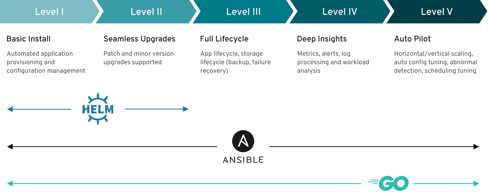
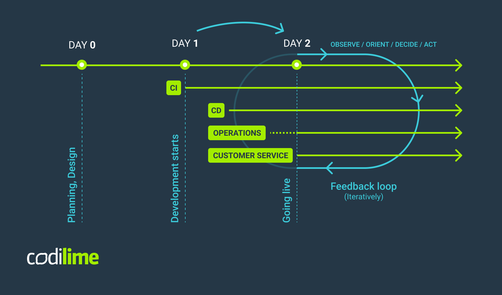
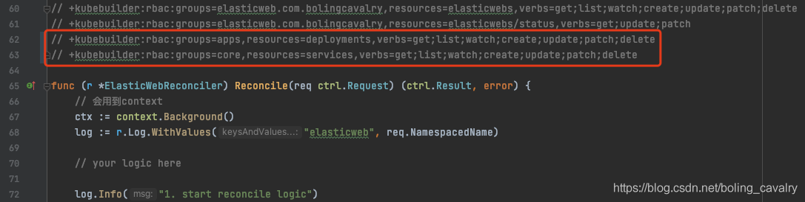

# Run Operator

## [Good Article](https://www.cnblogs.com/zisefeizhu/p/15922906.html)


## Type/Lv of Operator



# Why of Operator



## download kubebuilder and install locally

```sh
curl -L -o kubebuilder https://go.kubebuilder.io/dl/latest/$(go env GOOS)/$(go env GOARCH)
chmod +x kubebuilder && mv kubebuilder /usr/local/bin/
```

## Create working directory

```sh
mkdir -p nginxtest
cd ./nginxtest
```

## Init Go project

```sh
kubebuilder init --domain=nginx.com --repo=nginx.com/nginx-deployer
# --domain can be omitted
```


## Project Structure

用戶有關的：

| Directory/file             | Usage                                            |
| :------------------------- | :----------------------------------------------- |
| api/*_type.go              | CR 的 Golang 定義，用於 generate CRD             |
| controller/*_controller.go | 用戶應該添加邏輯的 go 檔案，reconcilation 的邏輯 |

用戶無關的：

| Directory/file  | Usage                                           |
| :-------------- | :---------------------------------------------- |
| config/crd      | CRD and K8s 資源的 "kustomize" Project          |
| config/samples/ | CRD 的 sample 發佈 yaml                         |
| config/default  | 包含 Kustomize base 的 标准配置, 用于启动控制器 |
| config/manager  | 在集群中以 pod 的形式启动控制器                 |
| config/rbac     | 設定在自己的账户下运行控制器所需的权限          |
| main.go         | 生成项目的入口函数                              |

## Create CRD & API

```sh
kubebuilder create api --group ng --version v2beta2 --kind Nginxset
# API version = ng.nginx.com/v2beta2
```

## All Makefile Phony

```sh
.PHONY: all
.PHONY: help
.PHONY: manifests       # 等於 build 出 project 的 crd 至 /config/crd/bases/
.PHONY: install         # 安裝 debug 版 CRD 至 cluster
.PHONY: uninstall       # 刪除 debug 版 CRD
.PHONY: run             # 運行你的 debug controller
.PHONY: generate
.PHONY: fmt
.PHONY: vet
.PHONY: test
.PHONY: build           # use GO build the "main.go"
.PHONY: docker-build    # build controller 的 image
.PHONY: docker-push     # upload controller 的 image e.g.: make docker-build docker-push IMG=<registry>/:tag
.PHONY: deploy          # 將控制器部署到集群
.PHONY: undeploy        # 將控制器取消部署到集群
.PHONY: kustomize
.PHONY: controller-gen
.PHONY: envtest
```

## Use Flow:

```sh
# 更新 /api/ 內容後
make

# build manifests （可以省略）
make manifests

# 將 CRD 安裝到集群中：
make install

# 檢查是否安裝了 CRD
kubectl api-versions
kubectl api-resources
# api-version = <group-name>.<domain-name>/<version>
```

| type         | sample value           |
| :----------- | :--------------------- |
| crd-name     | nginxsets.ng.nginx.com |
| api-version  | ng.nginx.com/v2beta2   |
| api-resource | nginxsets              |
| Kind         | Nginxset               |

```sh
# 運行你的控制器（這將在前台運行，所以如果你想讓它繼續運行，請切換到一個新的終端）：
make run

# 創建自定義資源
kubectl apply -f config/samples/
```

```sh
# Build Controller 的 image
make docker-build docker-push IMG=registry.greatics.net/guestbook

# Deploy the controller to the cluster with image specified by IMG: like "make run", but as pod
make deploy IMG=registry.greatics.net/guestbook
```

<br/>

---

<br/>

# Create Operator

## 1: Update "Nginxset" spec and status, replace below in "api/<api-version>/nginxset_types.go"

### in Spec Section
```go
// NginxsetSpec defines the desired state of Nginxset
type NginxsetSpec struct {
	// INSERT ADDITIONAL SPEC FIELDS - desired state of cluster
	// Important: Run "make" to regenerate code after modifying this file

	// target reture string
	ReturnText string `json:"returnText,omitempty"`
}
```

### in Status Section

```go
type NginxsetStatus struct {
	// INSERT ADDITIONAL STATUS FIELD - define observed state of cluster
	// Important: Run "make" to regenerate code after modifying this file

	// Ready represent the nginx behind this res is created or not
	Ready            bool   `json:"ready,omitempty"`
	LinkedDeployment string `json:"linkedDeployment,omitempty"`
}
```

then run

```sh
make
make install

# 檢查是否安裝了 CRD
kubectl api-versions
kubectl api-resources
```

## 2: Update "Reconcile" function in "controllers/nginxset_controller.go"

To check can listen resource changes, by updating the Reconcile func

```go
func (r *NginxsetReconciler) Reconcile(ctx context.Context, req ctrl.Request) (ctrl.Result, error) {
	_ = log.FromContext(ctx)

	// TODO(user): your logic here
	fmt.Println(req.Name)
	fmt.Println(req.Namespace)
	fmt.Println(req.NamespacedName)

	return ctrl.Result{}, nil
}
```

then run

```sh
make run

# in new terminal
kubectl apply -f config/samples/ng_v2beta2_nginxset.yaml

# should see names of resource log in terminal

# Update CR
k edit nginxsets.ng.nginx.com nginxset-sample

# should see the update in terminal
```

## 3: Create nginx pod according to CRD

Controller 的 Reconcile 如下：

- 如果 CR 实例不存在，则根据 CRD 创建
- - 创建 Deployment 资源
- - 创建 Service 资源
  
- 否則 CR 实例存在，则将 Annotations 中记录的 Spec 值与当前的 Spec 比较
- - 如果前后的 Spec 不同
- - - 更新 Deployment 资源
- - - 更新 Service 资源
- - 如果前后的 Spec 相同，则无需额外的操作
  
- 使用 Annotations 记录当前 Spec 的值

```go
```

```sh
# rerun controller with crtl-c
make run
```

<br/>

---

<br/>

## Watching External resource

https://book.kubebuilder.io/reference/watching-resources/externally-managed.html

<br/>

---

<br/>

## Extra

### Go client definition needed

```go
import (
	appsv1 "k8s.io/api/apps/v1"                   // for Deployment, StatefulSet
	corev1 "k8s.io/api/core/v1"                   // for Pod, Configmap
	metav1 "k8s.io/apimachinery/pkg/apis/meta/v1" // for Type
)
```

### Add get list column

```go
//+kubebuilder:...
//+kubebuilder:subresource:status
//+kubebuilder:printcolumn:name="Ready",type="string",JSONPath=`.status.ready`
//+kubebuilder:printcolumn:name="LastModify",type="date",JSONPath=`.metadata.creationTimestamp`
```

### Create Pod by Reconciler

```go
func createNewPod(ctx context.Context, req ctrl.Request, r *NginxsetReconciler) (err error) {
	newPod := v1.Pod{
		Spec: v1.PodSpec{
			Containers: []v1.Container{
				{
					Name:  fmt.Sprintf("%s-container", req.Name),
					Image: "nginx:alpine",
				},
			},
		},
	}

	newPod.Name = fmt.Sprintf("%s-pod", req.Name)
	newPod.Namespace = req.Namespace

	err = r.Create(ctx, &newPod)
	if err != nil {
		fmt.Println(fmt.Errorf("error: %v", err))
		return
	}

	return
}
```

### Update Resource Status

```go
nSet := v2beta2.Nginxset{}
err := r.Get(ctx, req.NamespacedName, &nSet)
if err != nil {
	fmt.Println(fmt.Errorf("error: %v", err))
	return ctrl.Result{Requeue: true, RequeueAfter: time.Second * 600}, nil
}

nSet.Status.Ready = "True"
nSet.Status.LinkedPod = string(newPod.UID)
r.Status().Update(ctx, &nSet)
```

### Use comments to update kubebulder configuration



## API Command Common

```sh
# 创建API
kubebuilder create api --group webapp --version v1 --kind Guestbook

# 创建webhook
kubebuilder create webhook --group elasticweb --version v1 --kind ElasticWeb --defaulting --programmatic-validation

# 构建和部署CRD (Dev)
make install

# build go lang code
make

# 本地运行controller (Dev) -> .kube.config
make run

# 构建镜像并推送到仓库
make docker-build docker-push IMG=registry.greatics.net/guestbook

# controller部署到kubernetes (Dev)
make deploy ...

# 删除controller
kustomize build config/default | kubectl delete -f -
```

## Kubebuilder Marker

[List of Marker](https://book.kubebuilder.io/reference/markers.html)

### Common Marker always used

| Section                    | Spec                                                                   | Usage                                                             |
| :------------------------- | :--------------------------------------------------------------------- | :---------------------------------------------------------------- |
| //+kubebuilder:subresource | :status                                                                | 开启 status 子资源，添加这个注释之后就可以对 status进行更新操作了 |
| //+kubebuilder:printcolumn | :name="Ready",type="string",JSONPath=`.status.ready`                   | 为 kubectl get 添加一列 Ready                                     |
|                            | :name="LastModify",type="date",JSONPath=`.metadata.creationTimestamp`  | 为 kubectl get 添加一列 LastModify                                |
| //+kubebuilder:rbac        | :groups=ng.nginx.com,resources=nginxsets/status,verbs=get;update;patch | 添加 RBAC 權限                                                    |