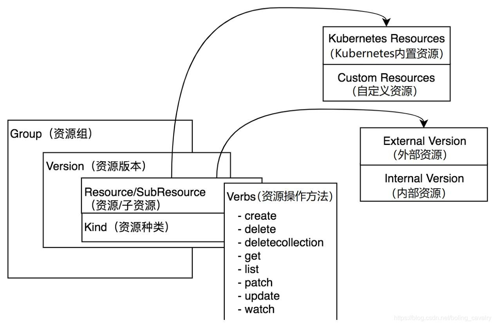
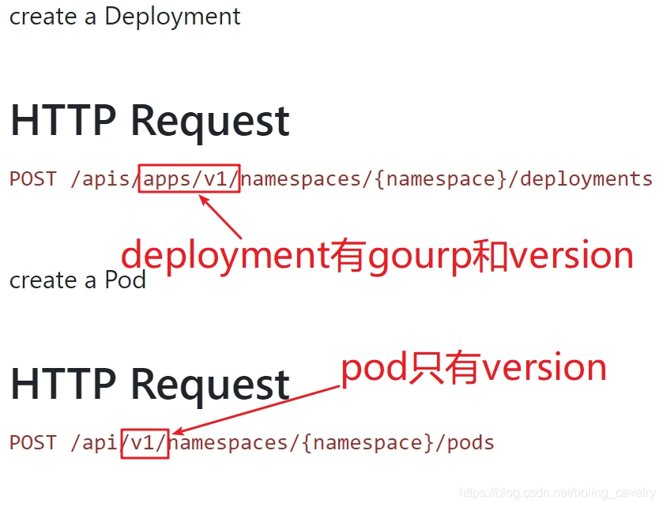
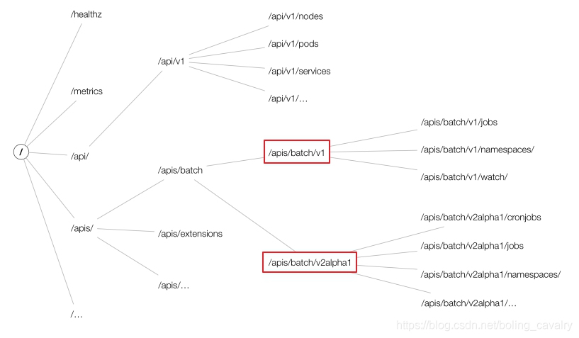
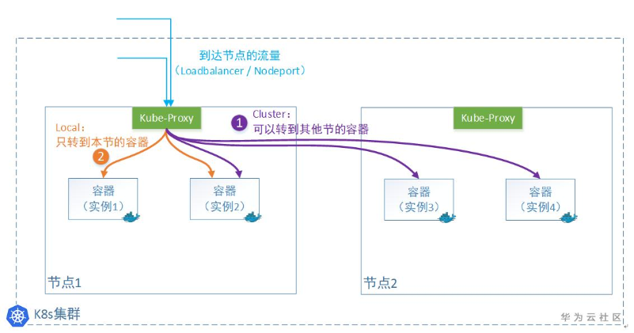
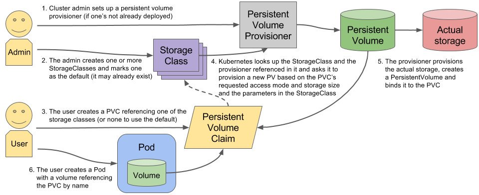
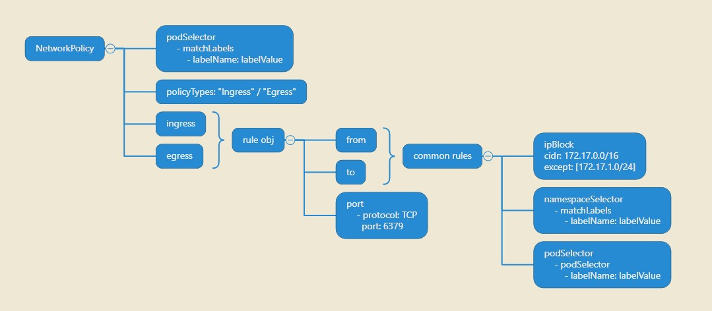
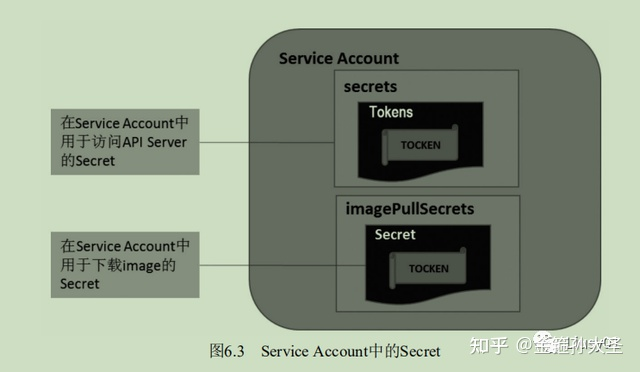
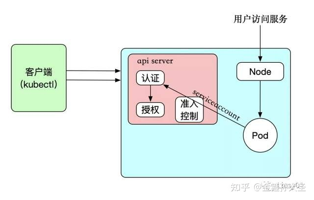
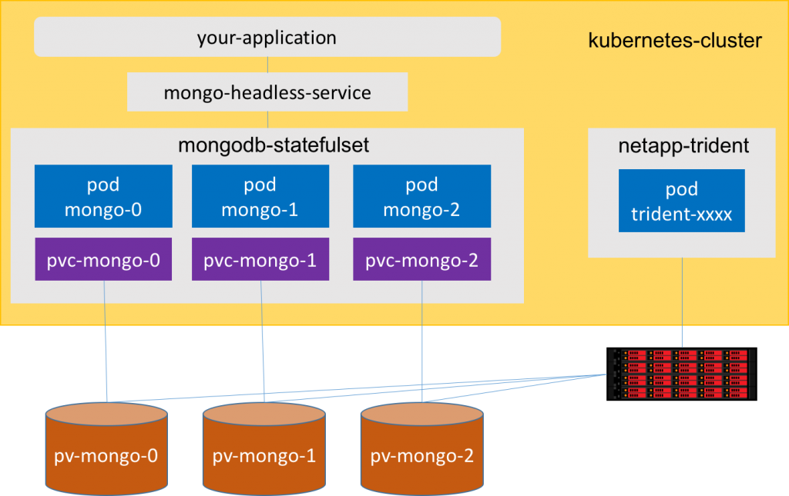

# kubectl CLI

API [Reference](https://kubernetes.io/docs/reference/generated/kubectl/kubectl-commands#get)

cluster-wide:

- [context](#context)
- [cluster](#cluster-information)
- [cluster-wide command](#cluster-wide-command)

K8s's Resources:

- [node & namespace](#node-no--namespace-ns)
- [pod (po)](#pod-po)
- [deployment (deploy)](#deployment-deploy)
- [replicaset (rs)](#replicaset-rs)
- [replicationcontroller (rc)](#replicationcontroller-rc)
- [horizontalpodautoscaler (hpa)](#horizontalpodautoscaler-hpa)
- [service (svc)](#service-svc)
- [endpoint (ep)](#endpoint-ep)
- [ingress (ing)](#ingress-ing)
- [secret](#secret)
- [configmap (cm)](#configmap-cm)
- [jobs (job)](#jobs-job)
- [cronjobs (cj)](#cronjobs-cj)
- [storageclasses (sc)](#storageclasses-sc)
- [persistentvolumes (pv)](#persistentvolumes-pv)
- [persistentvolumeclaims (pvc)](#persistentvolumeclaims-pvc)
- [networkpolicies (netpol)](#networkpolicies-netpol)
- [events (ev)](#events-ev)
- [priorityclass (pc)](#priorityclass-pc)
- [resourcequota (quota)](#resourcequota-quota)
- [LimitRange (limits)](#limitrange-limits)
- [rbac - role & rolebinding & CertificateSigningRequest](#rbac---role--rolebinding--certificatesigningrequest)
- [subject of K8s](#subject-of-k8s)
- [subject - certificatesigningrequest (csr)](#certificatesigningrequest-csr)
- [subject - serviceaccount (sa)](#serviceaccount-sa)
- [subject - tokenrequest & tokenreview]
- [daemonset (ds)](#daemonset-ds)
- [statefulset (sts)](#statefulset-sts)
- [APIService]()
- [operator](#operator)

<br/>

---

<br/>

# Context

一份 config 由 3 個部分組成：

| 部分     | 描述                                   |
| :------- | :------------------------------------- |
| clusters | 聲明 available cluster 及 CA Cert      |
| users    | 聲明 User 及提供 Key 與 CA signed Cert |
| contexts | 綁定 User 與 Cluster                   |

## Context File Structure

```yaml
apiVersion: v1
kind: Config
preferences: {}
current-context: name-of-the-context-using-right-now

# 1: Declare of cluster
clusters:
  - name: kubernetes
    cluster:
      server: https://123.57.128.65:6443
      certificate-authority-data: ca-cert-in-base64
      certificate-authority: /path/to/ca.crt # all cert key can remove "-data" to use file based pem file 

# 2: Declare of User
users:
  - name: name-of-k8s-user
    user:
      client-certificate-data: cert-in-base64
      client-key-data: key-in-base64

# 2.1: Declare of User by Service Account Token
users:
  - name: name-of-k8s-service-account
    user:
      token: eyJhbGciOiJSUzI1NiIsI......

# 3: 綁定 User 與 Cluster
contexts:
  - name: name-of-context
    context:
      cluster: kubernetes
      user: name-of-k8s-user 
```

## Available Command  

```yaml
use-specific-config-file-one-time: 
  - kubectl --kubeconfig /path/to/context config get-contexts        # will override all other contexts

use-specific-config-file-one-session:
  - export KUBECONFIG='/path/to/context1:/path/to/contex2'
  - kubectl config get-contexts

# https://kubernetes.io/docs/reference/generated/kubernetes-api/v1.23/#podlist-v1-core
Raw-k8s-query:
  by-api-resource-path: kubectl api-resources                         # call by the [api/apis]/{APIVERSION}/{NAME} from "api-resources"
  get-pods:             kubectl get --raw "/api/v1/pods"
  get-pods-with-label:  kubectl get --raw "/api/v1/pods?pretty=true&labelSelector=app=sample-app"
  getting-deploy:       kubectl get --raw "/apis/apps/v1/deployments"

# Aggregator 允许开发人员编写一个自己的服务，把这个服务注册到 Kubernetes 的 APIServer 里面去，
# 这样我们就可以像原生的 APIServer 提供的 API 使用自己的 API 了，我们把自己的服务运行在 Kubernetes 
# 集群里面，然后 Kubernetes 的 Aggregator 通过 Service 名称就可以转发到我们自己写的 Service 里面去了。
# https://www.qikqiak.com/post/k8s-hpa-usage/
Api-Aggregation:      # Api-aggregation = add custom api to K8s's api set
  get-custom-metris:  kubectl get --raw "/apis/custom.metrics.k8s.io/v1beta1"
  get-metrics-server: # Need install metrics server
    - kubectl get --raw "/apis/metrics.k8s.io/v1beta1/namespaces/<namespace-name>/pods/<pod-name>"

Allowed-Config-Operation:
  context:
    list-context:       kubectl config get-contexts
    list-context-name:  kubectl config get-contexts -o name

    get-all-config:     kubectl config view
    get-display-byte:   kubectl config view --raw
    get-current-config: kubectl config view --minify
    embed-linked-creds: kubectl config view --flatten # useful for creating portable kubeconfig files

    set-context:        kubectl config set-context [context-name | --current] [--cluster=cluster_nickname] [--user=user_nickname] [--namespace=namespace]
    set-to-namespace:   kubectl config set-context --current --namespace=<namespace-name>
    unset-to-namespace: kubectl config unset contexts.<namespace-name>.namespace
    unset-to-namespace: kubectl config unset "contexts.$(kubectl config current-context).namespace" # unset namespace dynamically

    use-context:        kubectl config use-context [context-name]
    get-using:          kubectl config current-context
    del-context:        kubectl config delete-context [context-name]
    rename-context:     kubectl config rename-context [old-name] [new-name]
  cluster:
    list-cluster:       kubectl config get-clusters
    set-cluster:        kubectl config set-cluster
    del-cluster:        kubectl config delete-cluster [cluster-name]
  user:
    list-users:         kubectl config get-users
    del-user:           kubectl config delete-user [username]
  other-commands:
    - view          # common
    - set
    - set-credentials
    - unset
```

<br/>

---

<br/>

# Cluster Information (CKA Only)

```yaml
Cluster-Management:
  api-version:                         kubectl api-versions
  api-resouces:                        kubectl api-resources
  get-cluster-info:
    get-the-api-server-ip:             kubectl cluster-info
    get-detailed-cluster-info:         kubectl cluster-info dump
    check-container-runtime:           kubectl get nodes -o wide
  certificate:
    approve:                           kubectl certificate approve [csr-res-name]
    deny:                              kubectl certificate deny    [csr-res-name]
  taint:
    get-node-taint-status:             kubectl describe node/[node-name] | grep -i taint
  drain:
    強制清空-node-上的-pod:               kubectl drain [node-name] --force
    清空-node-上除了-ds-的-pod:           kubectl drain [node-name] --ignore-daemonsets
  cordon---將-node-設定成-unschedulable: kubectl cordon   [node-name]
  uncondon-將-node-設定成-schedulable:   kubectl uncordon [node-name]
```

## Debugging (No need for CKA)

```yaml
show-metrics-for-all-nodes:          kubectl top node/[node-name] # 初安裝可能需要等幾分鐘先會 work
mark-node-as-un/schedulabl:          kubectl [cordon|uncordon] node/[node-name]
drain-node-for-maintenance:          kubectl drain node/[node-name] # 會 auto condon
drain-node-beside-daemonsets:        kubectl drain node/[node-name] --ignore-daemonsets
expose-k8s-rest-api-to-local:        kubectl proxy --address='0.0.0.0' --port=8000 --accept-hosts='^*$' 
curl-apiser-by-user-credentials:     curl --cacert ./ca.crt --cert ./client.crt --key ./client.key https://apiendpoint:8443/api/
curl-apiser-by-sa-credentials:       curl -H "Authorization: Bearer $TOKEN" https://kubernetes

get-resource-description:            kubectl explain res.spec
```

## K8s API Structure

Get all Api version & resource: **"kubectl api-resources"**

[List(doc) of api](https://kubernetes.io/docs/reference/generated/kubernetes-api/v1.23/#podlist-v1-core)




**Because "v1" group is also called "core", so no need group name**

```yaml
- apiGroups:
  - "" # <- 這裏指的就是 “core” group api
```



### **G+V (Group + Version) = Apiversion**

| Section     | Spec                                                           | Sample Value API-Version                  |
| :---------- | :------------------------------------------------------------- | :---------------------------------------- |
| Protocol    | HTTP/HTTPS                                                     | http://                                   |
| Host        | The system service in "Default" namespace                      | kubernetes.default (default is namespace) |
| API-Version | Get in "kubectl api-resources"                                 | /(api/apis)/<api-version>                 |
| Namespace   | Define which namespace                                         | /namespaces/<namespaceName>               |
| Resource    | Resource under the API-Version, Get in "kubectl api-resources" | /<resourceName>                           |

```sh
# example url
## ("v1" & "apps/v1" are api-version)
https://kubernetes.default/api/v1/namespaces/default/pods
https://kubernetes.default/apis/apps/v1/namespaces/default/deployments
```

**Only "v1" api is under "/api", other api-version is under "/apis"**

Sample caller pls refer to the [RBAC](#rbac---role--rolebinding) section

<br/>

---

<br/>

# Cluster-wide Command

```yaml
use-namespace:       -n [namespace-name]
use-namespace:       -n [name --ignore-daemonsetsspace-name]
with-all-namespaces: (-A) --all-namespaces

get-resource:                   kubectl get res
get-resource-specific:          kubectl get res -o yaml | grep -iA 10 [key-name]    # 重要 Important ‼️‼️
get-multiple-resource-at-once:  kubectl get po,deploy,svc
follow-the-stdout:              kubectl get res -w (--watch)
get-resource-yaml:              kubectl get [res/res-name] -o yaml
get-res-value-by-json-key:      kubectl get [res/res-name] -o jsonpath='{.keyName}' # .items[*].meda = .items..meda & use '' always, unless for Bash function
get-res-with-annotation:        kubectl get [res/res-name] -o jsonpath='{.metadata.annotations}'
get-query-in-array:             kubectl get [res/res-name] -o jsonpath='{.users[?(.name == 'infra-prod')]}'
get-resource-in-table-rangeEnd: kubectl get [res/res-name] -o=jsonpath='{range .items[*]}{.metadata.name}{"\t"}{.status.startTime}{"\n"}{end}'
                                # range 後面選中的 value 必須是 array，然後就會在後邊的 “{}” 裏面 loop 出來，等於 for a in b 入邊的 "a" 禁

filter-res-by-yaml-key-value:   kubectl [get / delete / annotate / label] --field-selector key=1,key!=2
sorting-res:                    kubectl get [res/res-name] --sort-by='{.metadata.creationTimestamp}' # beside "items" keyName, others are same like "jsonpath"

describe-resoure:               kubectl describe [res/res-name] [-l]

declare-resource-by-file:
  apply:                        kubectl apply -f ./res.yaml
  replace-forcely:              kubectl replace -f ./res.yaml --force 
  show-res-diff-like-git:       kubectl diff -f ./res.yaml  
  view-last-applied:            kubectl apply view-last-applied [res/res-name]
  edit-last-applied:            kubectl apply edit-last-applied [res/res-name]
  edit-resource:                kubectl edit [res/res-name]
  partial-update-resource: >-   kubectl patch [res/res-name] -p '{"keyname": "keyvalue"}'

deleting-resources:
  delete-single-forcely:        kubectl delete [res/res-name] --force --grace-period=0
  delete-all-in-namespace:      kubectl delete --all [res] -n=[namespace-name]
  get-all-evicted:              kubectl get pods -A | grep -i evict
  batch-evicted-deletion:       ns=namespace_name; kubectl get pods -n $ns | grep -i evict | awk '{print $1}' | xargs kubectl -n $ns delete pod

label-query-related:
  list-resources-with-labels:   kubectl get [res/res-name] --show-labels
  exist-of-key:                 -l 'labelName'                          # -l == --selector
  absence-of-key:               -l '!labelName'
  equal-And-not-equal-to:       -l 'labelName=value,labelName2!=value2' # "," act as "AND" : != act as inverse
  query-by-multiple-value:      -l 'labelName in    (value, value2)'
  query-by-notin:               -l 'labelName notin (value, value2)'

status-query:
  by-args-field-selector:       kubectl get pods --field-selector=status.phase=Running                      

CRUD-by-"label"-or-"annotate":
  add-label-to-selected:        kubectl label [res] labelName=value
  update-label:                 kubectl label [res] labelName=value --overwrite
  delete-label:                 kubectl label [res] labelName-

set-command:
  update-image-for-pod:         kubectl set image pod/[pod-name] [container-name]=[new-img-name] ...[container-name]=[new-img-name]
  update-image-for-deploy:      kubectl set image deploy/[deploy-name] [container-name]=[new-img-name] ...[container-name]=[new-img-name]
  update-serviceacc-for-deploy: kubectl set serviceaccount deploy/[deploy-name] [serviceaccount-name]
  others-res-can-be-set:        [env, resources, selector, serviceaccount, subject]

debugging:
  port-forward-from-resource:   kubectl port-forward [po or deploy or svc]/[res-name] [host-port]:[container-port]
  port-forward-with-address:    kubectl port-forward [po or deploy or svc]/[res-name] [host-port]:[container-port] --address='0.0.0.0'

copy-files-directories:
  copy-out:                     kubectl cp <namespace>/<pod>:<remote-path> <local-path>
  copy-in:                      kubectl cp <local-path> <namespace>/<pod>:<remote-path>

other-不常用:
  wait-Experimental:            kubectl wait --for=jsonpath='{.status.phase}'=Running pod/busybox1 --timeout=30s -l='labelName'
  authorization-check:          kubectl auth can-i create pods --all-namespaces
  authorization-check-as-sbody: kubectl --as system:serviceaccount:<ns>:<sa> auth can-i create pods --all-namespaces
  attach:                       kubectl attach [pod-name] -i -c [container-name] # -i = interactive
  # Attach to a process that is already running inside an existing container. :: require --leave-stdin-open=true (-i)

```

### matchExpressions 就是 yaml 檔案內的 label-filter

```yaml
selector:
  matchLabels:
    label_name: label_value
  matchExpressions:
    - {key: label_name_1, operator: In,    values: [val-1,val-2]}
    - {key: label_name_2, operator: NotIn, values: [val-3,val-4]}
```

### kubectl apply -f inline string as file

```sh
cat <<EOF | kubectl apply -f -
apiVersion: v1
  kind: ServiceAccount
  metadata:
    name: tiller
    namespace: kube-system
EOF
```

<br/>

---

<br/>

# node (no) & namespace (ns)

```yaml
node:
  get-all-node-with-network-details: kubectl get node -o wide
  get-all-namespaces:                kubectl get ns
```

<br/>

---

<br/>

# pod (po) - CKAD

- "pod" is the basic(only) computing unit in K8s's, for "deployment", "replicaSet", "jobs", "cronjobs"...
- "deployment" will spawn "pods" by "replicaSet"
- "job" and "cronjob" will also create "pods" for running processes

## Pod Phases and Status

| Phases                     | 描述                                                                                                                        |
| :------------------------- | :-------------------------------------------------------------------------------------------------------------------------- |
| Pending（悬决）            | Pod 已被 Kubernetes 系统接受，但有一个或者多个容器尚未创建亦未运行。此阶段包括等待 Pod 被调度的时间和通过网络下载镜像的时间 |
| Running（运行中）          | Pod 已经绑定到了某个节点，Pod 中所有的容器都已被创建。至少有一个容器仍在运行，或者正处于启动或重启状态                      |
| Succeeded/Complete（成功） | Pod 中的所有容器都已成功终止，并且不会再重启                                                                                |
| Failed（失败）             | Pod 中的所有容器都已终止，并且至少有一个容器是因为失败终止。也就是说，容器以非 0 状态退出或者被系统终止                     |
| Unknown（未知）            | 因为某些原因无法取得 Pod 的状态。这种情况通常是因为与 Pod 所在主机通信失败。                                                |

| Status 状态          | 描述                                                                                                                                                                                                  |
| :------------------- | :---------------------------------------------------------------------------------------------------------------------------------------------------------------------------------------------------- |
| Waiting （等待）     | 如果容器并不处在 Running 或 Terminated 状态之一，它就处在 Waiting 状态。 处于 Waiting 状态的容器仍在运行它完成启动所需要的操作：例如，从某个容器镜像 仓库拉取容器镜像，或者向容器应用 Secret 数据等等 |
| Running（运行中）    | running 状态表明容器正在执行状态并且没有问题发生。 如果配置了 postStart 回调，那么该回调已经执行且已完成                                                                                              |
| Terminated（已终止） | 处于 Terminated 状态的容器已经开始执行并且或者正常结束或者因为某些原因失败                                                                                                                            |

## Resource Structure

```yaml
apiVersion: v1
kind: Pod
metadata:
  name: ""
  namespace: ""
  labels: {}
  annotations: {}
spec: # IPSSRV
  imagePullSecrets: []       # secret used to authenticate image registry                         # 重要
  priorityClassName: ""      # when low resources, pods with high priority flag will kill later
  serviceAccountName: ""     # for pod to access k8s's resources, like dockerPullSecret           # 重要
  securityContext: {}        # defines privilege and access control for a Pod                     # 重要
  restartPolicy: Always      # behaviours after crash/finished “Never | Always | OnFailure”       # 重要
  volumes: {}                # declare what volumes will be using in pod                          # 重要
  containers:
    - name: ""               # Container's name, need specified if set new image
      image: ""              # Container's image
      command: []            # inject Init command
      securityContext: {}    # defines privilege and access control for a Container               # 重要
      livenessProbe: {}      # kill probe if no pass probe                                        # 重要
      readinessProbe: {}     # do not trun ready if no pass probe                                 # 重要
      startupProbe: {}       # If fails, kills container, container subjected to restart policy
      env: {}                # injest shell-lv variable                                           # 重要
      volumeMounts: []       # Mounting behaviour paired to .spec.volumes                         # 重要
      resources: {}          # limit hardware resource                                            # 重要
      lifecycle: {}          # Execute bash script in Pod lifecycle
      ports:
        - containerPort: 80  # To indicate which port will be used, but no actual effect
          protocol: tcp      # What protocol will the port using 

  initContainers:            # Container for initiation before official main container
    - name: config same as container # usage same as normal container
```

---

## **_.spec.priorityClassName_**

[Commonly related to K8s "PriorityClass" resource](#priorityclass-pc)

- PriorityClass 是一个无名称空间对象
- 值在必填的 value 字段中指定。值越大，优先级越高
- "priorityClass" which will be limited by "resourcequota"

Kubernetes 已经提供了 2 个 PriorityClass： system-cluster-critical 和 system-node-critical。 这些是常见的类，用于确保始终优先调度关键组件。

```yaml
priorityClassName: priorityclass-resource-name
```

---

## **_.spec.serviceAccountName_**

kubectl 使用 context 接触 api server

**_Pod 使用 服务帐户（例如，default）接触 api server_**

当你创建 Pod 时，如果没有指定服务账户，Pod 会被指定给命名空间中的 default 服务账户，如果你查看 Pod 的原始 JSON 或 YAML（例如：kubectl get pods/podname -o yaml）， 你可以看到 spec.serviceAccountName 字段已经被自动设置了。

[對應的 corresponding "ServiceAccount" 資源 resource](#serviceaccount-sa)

```yaml
apiVersion: v1
kind: Pod
metadata:
  name: my-pod
spec:
  serviceAccountName: absent and default value are "default"
```

---

## **_.spec.securityContext_**

## **_.spec.containers[\*].securityContext_**

运行容器时，可用 sysctl 命令修改内核参数，如 net、kernel 等，但 systcl 需要容器拥有超级权限才可以使用，在 Docker 容器启动时可以加--privileged 来使用特权模式。

**_privileged_**: container 内的 root 拥有真正的 root 权限。否则 container 内的 root 只是內部的一个普通用户权限。Docker 中，privileged 启动的容器，可以看到很多 host 上的设备，并且可以执行 mount。甚至允许你在 docker 容器中启动 docker 容器。Kubernetes 中使用 SecurityContext(安全上下文)，主要限制容器非法操作节点(Node)的系统级别内容，使节点系统或其他容器组受影响。

Kubernetes 提供了兩種配置安全上下文级别的方法：

- Container-level Security Context ：仅应用到指定的容器
- Pod-level Security Context ：应用到 Pod 内所有容器以及 Volume
- Pod Security Policies（PSP）：应用到集群内部所有 Pod 以及 Volume **(Deprecated)**

安全上下文包括但不限于：

| context                    | Usage                                                                                  |
| :------------------------- | :------------------------------------------------------------------------------------- |
| 自主访问控制（DAS）        | 基于用户 ID（UID）和组 ID（GID） 来判定对对象（例如文件）的访问权限                    |
| 安全性增强的 Linux/SELinux | 为对象赋予安全性标签。                                                                 |
| 特权模式 (privileged)      | 特权与容器外的进程相同,容易地将网络和卷插件编写为独立的 pod，不需要编译到 kubelet 中。 |
| Linux 权能                 | 为进程赋予 root 用户的部分特权而非全部特权                                             |
| AppArmor                   | 基于用户 ID（UID）和组 ID（GID） 来判定对对象（例如文件）的访问权限                    |
| Seccomp                    | 过滤进程的系统调用                                                                     |
| readOnlyRootFilesystem     | 以只读方式加载容器的根文件系统。                                                       |

如果忽略此字段，则容器的主组 ID 将是 root（0），等於 docker -u 0

runAsNonRoot & runAsUser != 0 就係 container 內就無得 sudo

```yaml
securityContext:
  # both pod / container lv
  runAsNonRoot: true              # highly Recommend in real production environment
  runAsUser: 1000                 # if can't find user(1000), will equal to not set
  runAsGroup: 3000                # uid=0(root) gid=0(root) groups=10(wheel)
  fsGroup: 2000

  # container-lv Only
  allowPrivilegeEscalation: true  # For container getting pod root
  privileged: true                # For container getting pod root
```

---

## ***.spec.imagePullSecrets***

Related to K8s's ["Secret" - docker-registry](#secret)

---

## ***.spec.volumes***

beside below 5 common kinds, could also be many alternative cloud storage, others pls reference to [pod.spec.container.volumeMounts](#speccontainersvolumemounts)

- .emptydir
- .configmap
- .secret
- .persistentVolumeClaim
- .hostPath
- .gitRepo (已弃用) - 如果需要在容器中提供 git 仓库，请将一个 EmptyDir 卷挂载到 InitContainer 中，使用 git 命令完成仓库的克隆操作

### Declare of volumes

```yaml
volumes:
  # declare a clear linux file directory
  - name: linux-style-directory
    emptyDir: {}

  # declare a volume by configmap
  - name: volume-from-configmap
    configMap:
      name: name-of-configmap-resource
      defaultMode: 0400 # change cm file as user read-only

  # declare a volume by secret
  - name: volume-from-secret
    secret:
      secretName: name-of-ecret
      defaultMode: 0400 # Secret 卷挂载所创建的所有文件的访问模式都是 0400            

  # volume from PVC
  - name: volume-from-pvc       
    persistentVolumeClaim:
      claimName: name-of-pvc

  # hostPath 将主机节点文件系统的文件/目录挂载到 Pod 中
  - name: test-volume
    hostPath:
      type: Directory | File               # 此字段为可选
      path: /data                          # 宿主上目录位置
```

---

## ***.spec.volumes[\*].[configmap/secret].items***

用於自定義 directory 結構

```yaml
apiVersion: v1
kind: ConfigMap
metadata:
  name: trial-cm
data:
  index.html: <p>hi aco</p>
  text-string: this is txt

---
apiVersion: apps/v1
kind: Deployment
metadata:
  labels:
    app: ddp
  name: ddp
spec:
  replicas: 1
  selector:
    matchLabels:
      app: ddp
  strategy: {}
  template:
    metadata:
      labels:
        app: ddp
    spec:
      containers:
        - image: nginx:alpine
          name: nginx
          resources: {}
          volumeMounts:
            - name: cm-vol
              mountPath: /usr/share/nginx/html
      volumes:
        - name: cm-vol
          configMap:
            name: trial-cm               
            items:                            # 如不設定，key 名就會直接變成 file 名，並只有一層 directory   ：：   重要 Important ‼️‼️
              - key: "index.html"
                path: "index.html"            # 將 configmap 的 key "index.html" 掛載至 /index.html
              - key: "text-string"
                path: "subdirectory/t2.txt"   # 將 configmap 的 key "text-string" 掛載至 /subdirectory/t2.txt (as file)
```

---

## ***.spec.restartPolicy***

**注意！！**

- K8s 會自動檢測 Pod 的主綫程（cmd / process）是否已非 0 退出，如是，已經會 kill pod 重啓
- k8s kill pod 重啓機制就是 restartPolicy
- 所以 livenessProbe 的用途不是用於監測 主綫程（cmd process） 的健康，而是業務上的機制

values could Only be:

| Possible Value | Function                                                                 |
| :------------- | :----------------------------------------------------------------------- |
| Always         | 當主進程完結時以 0 結束（Succeeded） 或 非 0 完結(Failed) 時，重啟容器   |
| OnFailure      | cmd/process 為非 0 完結(Failed) 時，继续留在当前节点，但容器会被重新运行 |
| Never          | 永不重啟                                                                 |

---

## ***.spec.containers[\*].volumeMounts***

Mounting 過程中會使用 docker mount，所以整個 directory 會被 overwrite

**## volumeMounts: !!! configmap/secret mount as volume 既時候，yaml structure 會變成 folder structure, Key 名就係 file 名**

```yaml
volumeMounts:                              # 同名 resource 可在多個地方挂在
  - name: name-of-volume                   # Declared in ".spec.volumes"
    mountPath: /path/to/mount/to/xml.json  # # 這應該是你的最終的 URI
    subPath: xml.json                      # 放置在/etc裡面的文件名，這里和mountPath裡面使用的文件名應該是一樣的。
```

---

## ***.spec.container.env***

inject value AS Linux Env Variable by 3 ways:

- direct hardcode value
- value from configmap
- value from secret

```yaml
env:
  - name: ENV_BY_CONFIG_MAP
    value: "Hardcoded value"

  - name: ENV_BY_CONFIG_MAP
    valueFrom:
      configMapKeyRef:
        name: configmap-resource-name
        key: username                    # [.data.username] in configMap
        
  - name: ENV_BY_SECRET                  # env by secret
    valueFrom:
      secretKeyRef:
        name: secret-resource-name
        key: password                    # [.data.password] in secret

  - name: POD_IP                         # 通过环境变量将 Pod 信息呈现给容器
    valueFrom:                           # https://kubernetes.io/zh-cn/docs/tasks/inject-data-application/environment-variable-expose-pod-information/
      fieldRef:
        fieldPath: status.podIP
  - name: MY_POD_NAME
    valueFrom:
      fieldRef:
        fieldPath: metadata.name
```

---

## ***.spec.container.resources***

pod's resources ARE Related to K8s "ResourceQuota" resources (namespace-lv resources control)

spec 中没有 cpu 和内存需求值的 Container 定义默认 CPU 限制值与需求值 150m，内存默认需求值 300Mi。

```yaml
resources:
  requests:
    memory: "150Mi"
    cpu: "150m"
  limits:
    memory: "300Mi"
    cpu: "150m"
```

---

## ***.spec.container.lifecycle***

- postStart 处理函数的调用不保证早于容器的入口点（entrypoint） 的执行。postStart 处理函数与容器的代码是异步执行的
- Kubernetes 的容器管理逻辑会一直阻塞等待 postStart 处理函数执行完毕。 只有 postStart 处理函数执行完毕，容器的状态才会变成 RUNNING
- 只有在 Pod 结束（Terminated） 的时候才会发送 preStop 事件， 这意味着在 Pod 完成（Completed） 时 preStop 的事件处理逻辑不会被触发。这个限制在 issue #55087 中被追踪。

```yaml
# Pod lifecycle event
spec:
  containers:
    - resources: {}
      lifecycle:
        # postStart 命令在容器的 /usr/share 目录下写入文件 message
        postStart:
          exec:
            command: ["/bin/sh","-c","echo Hello from the postStart handler > /usr/share/message"]

        # 命令 preStop 负责 grace stop nginx 服务。当因为失效而导致容器终止时，这一处理方式很有用。
        preStop:
          exec:
            command:
              ["/bin/sh","-c","nginx -s quit; while killall -0 nginx; do sleep 1; done"]
```

---

## **_.spec.container.{livenessProbe/readinessProbe/startupProbe}Probe_**

Available Probes:

| Type of Probe                  | Function                                                                                                                                                                                                                                     |
| :----------------------------- | :------------------------------------------------------------------------------------------------------------------------------------------------------------------------------------------------------------------------------------------- |
| .spec.container.livenessProbe  | 容器中进程能在遇问题或不健康情况下自行崩溃，则不一定需要存活态探针; kubelet 根据 Pod 的 restartPolicy 自动执行修复操作,如果你希望容器在探测失败时被杀死并重新启动，那么请指定一个存活态探针，并指定 restartPolicy 为 "Always" 或 "OnFailure" |
| .spec.container.readinessProbe | 就绪态探针意味着 Pod 在启动阶段不接收任何数据                                                                                                                                                                                                |  |
| .spec.container.startupProbe   | 如果你的容器启动时间通常超出 initialDelaySeconds + failureThreshold × periodSeconds 总值，你应该设置一个启动探测，对存活态探针所使用的同一端点执行检查，否則會被杀死并重新启动                                                               |  |  |

Check mechanisms:

- .exec.command
- .httpGet
- .tcpSocket
- .gRPC（少用）

Possible Result of Probe:

- "Success"
- "Failure"
- "Unknown"

```yaml
# Type 1: Run CMD
livenessProbe:
  initialDelaySeconds: 5
  periodSeconds: 5
  exec:
    command:
      - cat
      - /tmp/healthy

# Type 2: HTTP request Status code check, kill if code < 200 || > 400
livenessProbe:
  initialDelaySeconds: 5
  periodSeconds: 5
  httpGet:
    path: /healthz?checktoken=gh8g804
    port: 8080
    httpHeaders:
      - name: X-Custom-Header
        value: Awesome

# Type 3: TCP handshake to a port
readinessProbe:
  initialDelaySeconds: 5
  periodSeconds: 5
  tcpSocket:
    port: 8080
```

---

## **_.spec.container.ports_**

```yaml
ports:
  - containerPort: 80    # Not complusive, no actual effects, just for showing info, like EXPOSE in dockerfile
    protocol: tcp | udp  # optional, default tcp
```

---

## **_.spec.container.args_**

```yaml
args:
  - sh
  - -c
  - >
    this is
    multi-line
    command!
```

---

## Available Command

```yaml
Run-a-pod:
  basic:                    kubectl run [pod-name] --image=[img-name]
  expose-port:                --port=8080
  dry-run:                    --dry-run=client | server
  pass-in-env:                --env="key=value"
  set-label:                  --labels="l1=v1,l2=v2"
  should-restart-after-crash: --restart=Never
  one-time-cmd-and-remove:    --rm -i --restart=Never => kubectl run [pod-name] --image=[img-name] --rm -i --restart=Never --command -- [command]
  one-time-curl-test-call:                               kubectl run [pod-name] --image=[img-name] --rm -i --restart=Never --command -- curl <optional-pod-name>.<svc-name>.<namespace-name>:<port-number>
  main-thread-default-command-with-custom-args:          kubectl run [pod-name] --image=[img-name] -- <arg1> <arg2> ... <argN>
  main-thread-custom-command-with-custom-args:           kubectl run [pod-name] --image=[img-name] --command -- <cmd> <arg1> ... <argN>
  # 簡單講："--command" 係改 start command， 無就係改 argument 

Pod-operation:
  list-all-container-inside-pod:     kubectl get pods/[pod-name] -o jsonpath='{.spec.containers[*].name}'
  change-pod-img:                    kubectl set image pods/[pod-name] [container-name]=[image-name]
logs:
  show-logs:                         kubectl logs pods/[pod-name]
  show-logs-sidecar/init-container:  kubectl logs pods/[pod-name] -c/--container [container-name]
  show-logs-from-all-containers:     kubectl logs pods/[pod-name] --all-containers=true
  get-pod-resource-consumed:         kubectl top pods/[pod-name] --sort-by="cpu"  # 重要 Important, 會考試的 ‼️‼️
  get-pod-container-consumption:     kubectl top pods --containers=true
  show-from-tail:                    kubectl logs --tail=20 pods/[pod-name]
  show-since:                        kubectl logs --since=1h pods/[pod-name]
exec-command-inside-pod:
  pod-w-single-container:            kubectl exec -it [pod-name] -- sh -c "ls -al"
  pod-w-sidecar-container:           kubectl exec -it [pod-name] --container [container-name] -- sh -c "ls -al"
  Attention:
    if-error: 'Error from server: error dialing backend: dial tcp: lookup <hostname>: Temporary failure in name resolution'
    fix:      Up date "/etc/hosts" in CP and all worker nodes
```

<br/>

---

<br/>

# pod (po) - CKA

[如何讓 pod 生成於特定的 node 上](https://kubernetes.io/zh-cn/docs/concepts/scheduling-eviction/assign-pod-node/)

可以使用下列方法中的任何一种来选择 Kubernetes 对特定 Pod 的调度：

- 与节点标签匹配的 nodeSelector
- 亲和性与反亲和性
- nodeName 字段

| Practices                           | Actual Usage                                                               |
| :---------------------------------- | :------------------------------------------------------------------------- |
| nodeSelector                        | 只能选择拥有所有指定标签的节点                                             |
| affinity / podAntiAffinity (亲和性) | 标明某规则是“软需求”或者“偏好”，这样调度器无法找到匹配节点时仍然调度该 Pod |
| tolerations (污點忍耐)              | 能對冲相應的 node‘s taint                                                  |
| taint (node 污點)                   | 屬於 node 的設定， 與 affinity 與 toleration 合作                          |
| nodeName                            | 直接指定 node，但有缺陷，詳細見下方                                        |

***Affinity, Tolerations, Taint 三者合作***

- 1：Taint 將不想 schedule 的 pod 驅逐
- 2：Affinity 讓 target pod 主動選擇 tainted node
- 3：Tolerations 讓 target pod 不被 tainted node 驅逐

## Resource Structure

```yaml
apiVersion: v1
kind: Pod
metadata: {}
spec:
  nodeSelector: {}    # 使用 kubectl get node --show-labels 确定这个 node 的特有标签
  affinity: {}        # 設定 pod 的 affinity to node
  tolerations: {}     # 對應於 node 的 “taint” 驅逐屬性的對應方案
  nodeName: ''        # 直接指定要使用哪一個 node
```

---

## **_.spec.nodeSelector_**

```yaml
# 使用 kubectl get node --show-labels 确定这个 node 的特有标签
spec:
  nodeSelector:                         
    label-from-node: label-value-from-node 
```

---

## **_.spec.affinity**

有兩種類型的親和力：

- nodeAffinity
- podAntiAffinity

```yaml
spec:
  containers:
  ...
  affinity:                                             
    nodeAffinity: []    # Pod 和 node 之間的親和性
    podAntiAffinity: [] # Pod 和同一 node 上的 Pod 的親和性, 用於平均 schedule pod 至不同的 node 上 (效果類似 deamonset)
```

兩種親和力都具有兩種 Execution：

- requiredDuringSchedulingIgnoredDuringExecution ：只有在规则被满足的时候才能执行调度
- preferredDuringSchedulingIgnoredDuringExecution ：调度器会尝试寻找满足对应规则的节点。如果找不到匹配的节点，调度器仍然会调度该 Pod

[Pls reference to the k8s document](https://kubernetes.io/zh-cn/docs/concepts/scheduling-eviction/assign-pod-node/#affinity-and-anti-affinity)

IgnoredDuringExecution 意味着如果节点标签在 Kubernetes 调度 Pod 时发生了变更，Pod 仍将继续运行。

```yaml
# example
apiVersion: v1
kind: Pod
metadata:
  name: storager-pvc-reader
spec:
  affinity:
    nodeAffinity:
      requiredDuringSchedulingIgnoredDuringExecution:
        nodeSelectorTerms:
          - matchExpressions:
              - key: kubernetes.io/hostname
                operator: In
                values:
                  - devenv-desktop
```

---

## **_.spec.tolerations & Taints_**

污点和容忍度（Toleration）相互配合，可以用来避免 Pod 被分配到不合适的节点上。 每个节点上都可以应用一个或多个污点，这表示对于那些不能容忍这些污点的 Pod，是不会被该节点接受的。

### Node taint API

```yaml
# 给节点 node1 增加一个污点，它的键名是 key1，键值是 value1，效果是 NoSchedule。 这表示只有拥有和这个污点相匹配的容忍度的 Pod 才能够被分配到 node1 这个节点。
# 操作方法同 label
給-node-添加-taint:            kubectl taint node [node-name] <name-of-key>=<value-of-key>:NoSchedule
給-node-移除-taint:            kubectl taint node [node-name] <name-of-key>=<value-of-key>:NoSchedule-  # 分別只有 “-” 號
專用的-nodes-taint(example):   kubectl taint node [node-name] dedicated=groupName:NoSchedule
Add/remove-taint-to-all-node: kubectl taint nodes --all <value-of-key>:NoSchedule-
Get-taint-from-all-node:      kubectl get nodes | tail -n +2 - | awk '{print $1}' | xargs kubectl describe node | grep -i taint
```

### Pod Yaml's Spec

```yaml
# 此 pod‘s 的 yaml 會對應抵銷上面的 taint
tolerations:
- key: key1
  operator: Equal | Exists  # if key existed, 如用 “Existed”，此时容忍度不能指定 value
  value: value1             # operator 的默认值是 Equal         
  effect: NoSchedule        # NoSchedule | PreferNoSchedule | NoExecute
  tolerationSeconds: 3600   # 只生效於 NoExecute，當 pod 被新 NoExecute taint 驅逐時，能等待的時間
```

<br/>

## -1 存在两种特殊情况

- 如果一个容忍度的 key 为空且 operator 为 Exists， 表示这个容忍度与任意的 key 、value 和 effect 都匹配，即这个容忍度能容忍任意 taint。
- 如果 effect 为空，则可以与所有键名 key1 的效果相匹配。

| effect (對應的 taint 屬性) | value                                                                          |
| :------------------------- | :----------------------------------------------------------------------------- |
| PreferNoSchedule           | 系统会 尽量 避免将 Pod 调度到存在其不能容忍污点的节点上， 但这不是强制的       |
| NoSchedule                 | 不能 schedule，將來，任何不能忍受这个污点的 Pod 都不會建立，**但現有的不影響** |
| NoExecute                  | 不能 execute，**現有及將來**，任何不能忍受这个污点的 Pod 都会马上被驱逐        |

<br/>

## -2 **NoExecute 會因為 cluster 狀態而自動出現**

前文提到过污点的 effect 值 NoExecute 会影响已经在节点上运行的 Pod

- 如果 Pod 不能忍受 effect 值为 NoExecute 的污点，那么 Pod 将马上被驱逐
- 如果 Pod 能够忍受 effect 值为 NoExecute 的污点，但是在容忍度定义中没有指定 tolerationSeconds，则 Pod 还会一直在这个节点上运行。
- 如果 Pod 能够忍受 effect 值为 NoExecute 的污点，而且指定了 tolerationSeconds， 则 Pod 还能在这个节点上继续运行这个指定的时间长度。

| 自動添加 NoExecute 的条件              | 原因                                                            |
| :------------------------------------- | :-------------------------------------------------------------- |
| node.kubernetes.io/not-ready           | 节点未准备好, 这相当于节点状态 Ready 的值为 "False"             |
| node.kubernetes.io/unreachable         | 节点控制器访问不到节点. 这相当于节点状态 Ready 的值为 "Unknown" |
| node.kubernetes.io/memory-pressure     | 节点存在内存压力                                                |
| node.kubernetes.io/disk-pressure       | 节点存在磁盘压力                                                |
| node.kubernetes.io/pid-pressure        | 节点的 PID 压力                                                 |
| node.kubernetes.io/network-unavailable | 节点网络不可用                                                  |
| node.kubernetes.io/unschedulable       | 节点不可调度                                                    |

比如，一个使用了很多本地状态的应用程序在网络断开时，仍然希望停留在当前节点上运行一段较长的时间， 愿意等待网络恢复以避免被驱逐使用这个功能特性，结合 tolerationSeconds，Pod 就可以指定当节点出现一个 或全部上述问题时还将在这个节点上运行多长的时间。

---

## **_.spec.nodeName_**

直接指定要使用哪一個 node, 使用 nodeName 来选择节点的方式有一些局限性：

- 如果所指代的节点不存在，则 Pod 无法运行，而且在某些情况下可能会被自动删除。
- 如果所指代的节点无法提供用来运行 Pod 所需的资源，Pod 会失败， 而其失败原因中会给出是否因为内存或 CPU 不足而造成无法运行。
- 在云环境中的节点名称并不总是可预测的，也不总是稳定的。

```yaml
spec:
  nodeName: "name of the node"
```

<br/>

---

<br/>

# deployment (deploy)

Deployment 不會直接建立 Pod，而是透過建立 ReplicaSet 建立

RollingUpdate 時，deployment 會建立新的 RS 生成新的 pod 逐步取代舊 RS 裡的 pod，所以deployment 會同時擁有兩個 RS

建立的 Pod 都必須擁有 label，Service 就會以 label 去選擇 expose 那些 Pod

## Resource Structure

```yaml
apiVersion: apps/v1
kind: Deployment
metadata:
  name: ''
  namespace: ''
  labels: {}
spec:
  replicas: 3
  revisionHistoryLimit: 1     # replicaset history to preserve, use with caution, it will also disable the rollback ability
  minReadySeconds: 10         # 最小就绪时间， 超出这个时间 Pod 才被视为可用。默认值为 0（Pod 在准备就绪后立即将被视为可用）
  progressDeadlineSeconds: 10 # 當部署過程長於設置時，停止更新並回滾部署
  strategy: {}                # action on pod handling when updating deployment
  paused: false               # Used to stop deployment update
  selector:
    matchLabels: {}           # IMPORTANT: labels for "Service" to select
  template:
    metadata: {}              # from pod yaml
    spec: {}                  # from pod yaml
```

---

## **_.spec.revisionHistoryLimit_**

Replicaset history to preserve, will auto delete old "RS", 會失去回滚到 Deployment 的对应修订版本的能力

**use with caution!**

---

## **_.spec.minReadySeconds_**

用于指定新创建的 Pod 在没有任意容器崩溃情况下的最小就绪时间， 只有超出这个时间 Pod 才被视为可用。默认值为 0（Pod 在准备就绪后立即将被视为可用）。 要了解何时 Pod 被视为就绪， 可参考容器探针。

---

## **_.spec.progressDeadlineSeconds_**

如果指定，则此字段值需要大于 .spec.minReadySeconds 取值。

指定系统在报告 Deployment 进展失败 之前等待 Deployment 取得进展的秒数。 这类报告会在资源状态中体现为 type: Progressing、status: False、 reason: ProgressDeadlineExceeded。
Deployment 控制器将持续重试 Deployment。 将来，一旦实现了自动回滚，Deployment 控制器将在探测到这样的条件时立即回滚 Deployment。

---

## **_.spec.strategy.type_**

```yaml
strategy:
  type: RollingUpdate # default
  type: Recreate      # 在创建新 Pods 之前，所有现有的 Pods 会被杀死
```

---

## **_.spec.strategy.rollingUpdate_**

只有 .spec.strategy.type 等於 "RollingUpdate"，這字段才可用

```yaml
rollingUpdate:
  maxUnavailable: 25% # 指定更新过程中不可用 Pod 数上限。可以是绝对数字或百分比（5 ｜ 10%），e.g.： 为 30% 时，至少有所需的 Pod 个数的 70%
  maxSurge: 25%       # 可以创建的超出期望 Pod 个数的 Pod 数量, e.g.:值为 30% 时，会对新的 ReplicaSet 扩容，保证新旧 Pod 的总数不超过所需 Pod 总数的 130%。
```

<br/>

---

<br/>

## Available Command

```yaml
create-deploy-with-start-cmd:      kubectl create deploy [deploy-name] --image=[img-name] -- sh -c "tar="/"; ls $tar"
get-deployment-yml-file-with-cmd:  kubectl create deploy [deploy-name] --image=[img-name] --dry-run=client -o yaml > deployment.yaml -- sh -c "tar="/"; ls $tar"
change-deploy-img:                 kubectl set image deploy/[deploy-name] [container-name]=[new-img-name] ...[container-name]=[new-img-name]
use-deploy-to-run-exec:            kubectl exec deploy/[deploy-name] -- sh -c "ls -la"
update-deployment:                 kubectl edit deploy/[deploy-name]
rollout:
  history:
    show-upgrade-history:          kubectl rollout history deploy/[deploy-name]
    show-specific-history:         kubectl rollout history deploy/[deploy-name] --revision
  status:
    get-deploy-status:             kubectl rollout status deploy/[deploy-name]
  restart:
    restart-deployment:            kubectl rollout restart deploy/[deploy-name]
  annotate:
    anno-current-rollout-msg:      kubectl annotate deploy/[deploy-name] kubernetes.io/change-cause="currentRolloutMsg"
  pause/resume:
    temp-stop:                     kubectl rollout pause deploy/[deploy-name]
    resume-again:                  kubectl rollout resume deploy/[deploy-name]
  undo:
    to-last-revision:              kubectl rollout undo deploy/[deploy-name]
    to-specific-revision:          kubectl rollout undo deploy/[deploy-name] --to-revision=[num]
```

### Valid resource types available for "undo" are

- deployments
- daemonsets
- statefulsets

<br/>

---

<br/>

### Always accompanied with Docker, Podman and Helm

**"rollout" in K8s, "rollback" in Helm**

```yaml
Docker-Podman:
  list-image:                       docker image ls
  build-image:                      docker build -t [image-and-tag] .
  tagging:                          docker tag [old-image-name-tag] [registry-name]/[new-image-name-tag]
  save-image-to-tar:                docker image save -o ./file-name.tar [image-name]
  load-image-from-tar:              docker image load -i ./file-name.tar

Helm:
  getting-info:
    list-all-installment:             helm list -A                                    # get all release in all namespaces,can get chart name in "CHART" column
    list-all-installment:             helm lint                                       # Check is the helm chart rendering is OK
    show-release-status:              helm status    [release-name]                   # also include the post-install message/logs
    get-res-yaml-under-helm:          helm status    [release-name] -o yaml
  install/upgrade:
    build-required-dependency:        helm dependency build
    install:                          helm install   [release-name] .                 # "." is the chart position, "." means current directory
    install-with-specific-version:    helm install   [release-name] . --version 1.0.0
    upgrade-even-if-no-installment:   helm upgrade   [release-name] . -i
    dry-run:                          helm upgrade   [release-name] . -i --dry-run
    get-upgrade-history:              helm history   [release-name]
    rollback:                         helm rollback  [release-name] <revision>
    set-custom-value:
                                      # the default "values.yaml" will always be loaded if existed,
                                      # but will be overwrite by -f
                                      # "-f", "--set", "--set-file" can be use altogether
      specify-extra-yaml-as-value:    helm [install/upgrade] [release-name] [chart-name] -f ./values.yaml
      by-cli:                         helm [install/upgrade] [release-name] [chart-name] --set [key-name]=[value]             
      by-file:                        helm [install/upgrade] [release-name] [chart-name] --set-file [key-name]=[path-to-yaml]
    global-flag:
      dry-run:                          --dry-run
      show-debug-message:               --debug   # dry-run 與 debug 一起用就是取得 rendered template
  uninstall:
    uninstall-no-preserve-history:    helm uninstall [release-name]                       # Remember to add "-n namespace" !!
    uninstall-and-preserve-history:   helm uninstall [release-name] --keep-history
  repo:
    repo(chart-warehouse)-operation:
      - list                          helm repo list                                           # 可以列出 repo 的 git repo，clone 後以 GitOps pattern 部處
      - add                           helm repo add    [local-repo-name] [chart-repo-url]      # helm repo add bitnami https://charts.bitnami.com/bitnami
      - remove                        helm repo remove [local-repo-name]                       # Whole repo index will be downloaded in to local
      - update                        helm repo update [local-repo-name]                       # then can be used to install as "helm install my-release bitnami/nginx"
    search-chart:                    
      - search-by-repo                helm search repo [search-string] [-o yaml (for details)] # 搜已 helm repo add 到本地 helm client 的 repo。搜本地数据，无需联外网。
      - search-by-hub                 helm search hub  [chart-name]                            # 会去helm hub上搜一些其他大佬们共享出来的chart。
  check-chart-parameters-or-release:
      - show-chart                    helm show chart  [local-repo-name]/[chart-name]
      - get-chart-params              helm show values [local-repo-name]/[chart-name]          # show all values can be overwrite by helm --set="value" cli parameter
      - get-values-used-in-release    helm get values  [release-name]                          # show all "USER-SUPPLIED VALUES" settled from "helm show values"
```

<br/>

---

<br/>

# replicaset (rs)

- 1, when create a deployment
- 2, deployment create a replicaset (RS)
- 3, RS create number of pods(replicas)
- 4, Therefore, One deployment can have multiple RS for canary deployment
- A- HPA give instructions to RS through deployment
- B- HPA make sure the RS fullfil amount of pods with HPA's rules

## Available Command

```yaml
# 一般情況下不會手動操作 Usually not done manually 
change target number of replicas:  kubectl scale deploy/[deploy-name] --replicas=10
```

<br/>

---

<br/>

# replicationcontroller (rc)

old version of "replicaset"

<br/>

---

<br/>

# horizontalpodautoscaler (hpa)

hpa 的設定較 rs（replicaset）有更高優先等級

使用 hpa 時，應該移除 deploy/sts 的 replica 數值

```yaml
apiVersion: autoscaling/v2
kind: HorizontalPodAutoscaler
metadata:
  name: hpa-name
spec:
  scaleTargetRef:
    apiVersion: apps/v1
    kind: Deployment
    name: deployment-name
  minReplicas: 1
  maxReplicas: 10
  metrics: {}

  # Deprecated
  targetCPUUtilizationPercentage: 50
```

---

## **_.spec.metrics[\*]_**

以下 3 種常見類型用於檢查指標：

.type =

- Resource
- Pods (need extra configuration)
- Object (need extra configuration)

.type.[type].target.type =

- Utilization (等於 percentage)
- AverageUtilization (平均 percentage)
- AverageValue (绝对数值)
- Value 类型 (直接与 API {經 APIServer 的 APIService 返回的在 Kubelet 的 Metric API 數據} 返回的度量指标比较)

```yaml
metrics:
  # 當 pod 的 resource (cpu/ram) 負荷超過 50%（平均）
  - type: Resource
    resource:
      name: cpu | memory
      target:
        type: Utilization
        averageUtilization: 50
```

---

## Available Command

```sh
# create new hpa for current deployment
kubectl autoscale deploy/[deploy-name] --min=2 --max=3 --cpu-percent=80

# get hpa yaml
kubectl autoscale deploy/[deploy-name] --min=2 --max=3 --cpu-percent=50 --dry-run=client -o yaml
```

<br/>

---

<br/>

# service (svc)

## Resource whici can be exposed

- pod (po)
- service (svc)
- replicationcontroller
- deployment (deploy)
- replicaset (rs)

## Attention

Service Name can be use with K8s DNS resolve, if NOT in SAME namespace, need add namespace string after domain(svc name)

e.g.: **_<http://[svc-name>].[namespace-name]:[port-number]_**

or a prefix namespace + "/"

e.g.: **_<http://[namespace-name]/[svc-name>]:[port-number]_**

"kubernetes" service is default existed, pod can call k8s api through this service.

### [Default Storage Class - 不考](https://kubernetes.io/zh-cn/docs/tasks/administer-cluster/change-default-storage-class/)

```yaml
annotations:
  storageclass.kubernetes.io/is-default-class: "true"
```

## Resource Structure

```yaml
apiVersion: v1
kind: Service
metadata:
  name: aco-nginx-service-1
spec:
  type: NodePort
  selector:
    app: aco-nginx-1    # <<== for service to select pods
  ports:
    - nodePort: 30800   # port used for worker node
      port: 8080        # 此為 service vip(virtual IP) 對外開放的 port, （上）去 nodePort，（下）去 targetPort
      targetPort: 80    # 此為 Pod 對外開放的 port number
      name: of-service  # Port-forward 的時候可以用這個名字代替 port 的數字
```

## Canary Deployment

Two Deployment with different number of replicas, then a service to expose/loadbalance both deployment by common label

兩個具有不同副本數量的 deployment，然後一個服務，通過公享標籤 暴露/loadbalance 兩個部署

```yaml
apiVersion: v1
kind: List
items:
  - apiVersion: apps/v1
    kind: Deployment
    metadata:
      name: canary-01-deploy
    spec:
      replicas: 3
      selector:
        matchLabels:
          app: canary-01-pod
          user: aco
      template:
        metadata:
          labels:
            app: canary-01-pod
            user: aco
        spec:
          containers:
            - name: canary-01-container
              image: node:alpine
              command: [npx, http-server, -c-1, -p, "80"]
  - apiVersion: apps/v1
    kind: Deployment
    metadata:
      name: canary-02-deploy
    spec:
      replicas: 3
      selector:
        matchLabels:
          app: canary-02-pod
          user: aco
      template:
        metadata:
          labels:
            app: canary-02-pod
            user: aco
        spec:
          containers:
            - name: canary-02-container
              image: nginx:alpine
  - apiVersion: v1
    kind: Service
    metadata:
      name: canary-svc
    spec:
      type: ClusterIP
      selector:
        user: aco
      ports:
        - port: 8080
          targetPort: 80
```

---

## **_.spec.type_**

| Available Service Type   | usage                                                                                                                                                               |
| :----------------------- | :------------------------------------------------------------------------------------------------------------------------------------------------------------------ |
| NodePort                 | 所有 worker node 都會開放的 port                                                                                                                                    |
| ClusterIP                | 只是用 Cluster 内的 network                                                                                                                                         |
| LoadBalancer (ExtenalIP) | 云供應商用，會打開所有 node 的某個 port （效果其實同 NodePort 類似，但可以在30000以下），並接受雲平臺的 loadbalancer 流量輸入，e.g.: Alicloud SLB                   |
| ExternalName             | 路由至域外，类似于 IPv4 地址的外部名称不能由 CoreDNS 或 ingress-nginx 解析，因为外部名称旨在指定规范的 DNS 名称。 要对 IP 地址进行硬编码，请考虑使用无头 Services。 |

### Headless

- spec.clusterIP = null，运行时不分配 ClusterIP, service关联 pod 時候會為 pod 建立 endpoint, endpoint 都会有对应的DNS域名, Pod之间就可以穩定地互相访问 ()
- headless 是指 service 不像普通 svc 那樣，在 selector 選中的 pod 中所有 endpoint 裏返回一個已經 loadbalanced 既 endpoint，而是返回所有 selected 既 ep，讓應用程序自己決定 call 哪一個
- Headless Service的对应的每一个Endpoints，即每一个Pod，都会有对应的DNS域名；这样Pod之间就可以互相访问
- （即係）headless svc 下的 pod 會可以加 pod 名前於 svc 名為 DNS 名稱，以用於直接連接， **(因爲 headless svc 不會 resolve/loadbalance target endpoint 比你 ！)**

### **statefulset 需要 Headless 提供綁定 pod 的功能，同時需要額外的 server 正常地 expose server 比 client（ingress） 使用**

```yaml
spec:
  type: NodePort
```

---

## **_.spec.selector_**

## selector 會 loadbalance 至 所有符合此 label 的 pods，所以 service 可以 loadbalance 至不同的 deployment，同時 lb 至新和舊的 deployment 就可以實現 partial update 

---

## **_.spec.ports_**

| Port Key   | usage                            |
| :--------- | :------------------------------- |
| nodePort   | 所有 worker node 都會開放的 port |
| port       | service vip 會開放的 port        |
| targetPort | container 會開放的 port          |

透過以上的定義，會產生出以下的 network topology：

## **worker node(nodeIP:30800) <---> Service(tcp:8080, with VIP) <---> Pod;Endpoint(tcp:80)**

```yaml
ports:
  - nodePort: 30800
    port: 8080
    targetPort: 80
```

---

## Available Command

```yaml
For-service:
  port-forward-from-remote-pod:      kubectl port-forward pod/[pod-name] [host-port]:[container-port] # address for binding to all IP
  port-forward-from-remote-svc:      kubectl port-forward svc/[pod-name] [host-port]:[svc-ip-port]    --address 0.0.0.0 
  by-service-create:                 kubectl create svc [service-name] # args are same with "expose"
  by-resource-expose:                kubectl expose [res/res-name]
                                       --type="NodePort" | "ClusterIP" | "LoadBalancer"  # important, NodePort 會自動被設定 ！！
                                       --port=8080                                       # important  
                                       --target-port=8000                                # important
                                       --name=[service-name]                             
                                       --tcp 3333:80
                                       --protocol=UDP
```

<br/>

---

<br/>

# endpoint (ep)

- (重要) 每創建一個 service，都會自動創建一個 **同名** 的 ep 資源，這個 ep 資源裏面就是 under 這個 service selector 選中了的 pod 的 IP 地址
- Headless service 就是一種不會創建 ep 的 type
- 原理就是 svc 會 resolve 成某一個 pod 既 IP (with loadbalancer),
- 或 resolve 成 List of 所有 ep 入邊既 IP (headless)
- 所以其實不一定需要係 pod，external 既 IP 都可以
- custom ep 可以用來 proxy_pass 去出面既 IP

```sh
kubectl get ep
# "kubernetes" is endpoint of the API server inside the cluster
```

## Example: proxy_pass by service to LAN/WAN IP

```yaml
apiVersion: v1
kind: Endpoints
metadata:
  name: custom-endpoint
subsets:
  - addresses:
      - ip: 192.168.0.15
    ports:
      - port: 3000
---
apiVersion: v1
kind: Service
metadata:
  name: custom-endpoint
spec:
  clusterIP: None
  type: ClusterIP
  ports:
    - port: 3000
      targetPort: 3000
```

```sh
# Then can test call by:
kubectl run tmp --image=nginx:alpine --rm -i --restart=Never --command -- curl http://custom-endpoint:3000
```

<br/>

---

<br/>

# ingress (ing)

**每一個 ingress resource 都會變成一個 nginx 的 server config obj**

## Resource Structure

```yaml
apiVersion: networking.k8s.io/v1
kind: Ingress
metadata:
  name: ingress-name
spec:
  ingressClassName: nginx            # Type of Ingress, can use Envoy also
  tls:                               # Implement HTTPS certificate
    - secretName: testsecret-tls
      hosts:
        - https-example.foo.com
  defaultBackend: {}                 # Service handler if no route is found
  rules:
    - host: localhost                # (optional) 如果不設定 “host“，就會處理所有去本機 IP 既 inbound traffic 
      http:                          #            (not working in minikube)
        paths:
          - path: /subpath(?:/|$)(.*)  # Example:
            pathType: Prefix | Exact # https://kubernetes.io/zh/docs/concepts/services-networking/ingress/#%E7%A4%BA%E4%BE%8B
            backend:
              service:
                name: svc-name
                port:
                  number: 8080
          - path: /(.*)
            pathType: Prefix
            backend:
              service:
                name: svc-root
                port:
                  number: 8080
```

## Command To create ingress

```sh
# kubectl create ingress NAME --rule=host/path=service:port[,tls[=secret]]  [options]
kubectl create ingress ing-name --rule=localhost/=svcnginx:80
```

注意：Nginx proxy pass 入 ingress 的時候， 要有 "proxy_set_header Host $host;" 及最好有 "real_ip_header X-Real-IP;"

## Hostname wildcards

| Host      | Host header     | Match?                                            |
| :-------- | :-------------- | :------------------------------------------------ |
| *.foo.com | bar.foo.com     | Matches based on shared suffix                    |
| *.foo.com | baz.bar.foo.com | No match, wildcard only covers a single DNS label |
| *.foo.com | foo.com         | No match, wildcard only covers a single DNS label |

## Available annotation

<https://kubernetes.github.io/ingress-nginx/user-guide/nginx-configuration/annotations/>

### Set default ingress

```yaml
annotations:
  ingressclass.kubernetes.io/is-default-class: "true"
```

### Use External Name Service to strean Ingress to Service in other namespace

```yaml
apiVersion: v1
kind: Service
spec:
  externalName: svc.otherNamespace
```

```yaml
annotations:
  ingressclass.kubernetes.io/is-default-class: "true"
```

## Custom Stream snippet

<https://kubernetes.github.io/ingress-nginx/user-guide/nginx-configuration/annotations/#stream-snippet>

## External Traffic Policy

Used to config when request travel inside cluster, what IP should the request carry, the outside one or the inner-cluster one



!!這發生在 Kubelet 層面，同時 Local 流量不可以導流去其他 Node，所以同 node 中沒有目標 pod 時，nginx redirect 會失敗

- 1）Cluster表示：流量可以转发到其他节点上的Pod。
- 2）Local表示：流量只发给本机的Pod。

```sh
k -n kube-system get svc/nginx-ingress-lb -o yaml

# patch externalTrafficPolicy
k patch -n kube-system svc/nginx-ingress-lb -p '{"spec":{"externalTrafficPolicy":"Local"}}'
```

```yaml
apiVersion: v1
kind: Service
metadata:
  name: nginx-ingress-lb
  namespace: kube-system
spec:
  externalTrafficPolicy: Cluster # "Cluster" = keep internal IP, "Local" = keep external IP
  internalTrafficPolicy: Cluster
```

<https://www.cnblogs.com/zisefeizhu/p/13262239.html>
<https://stackoverflow.com/questions/47990836/kubernetes-whitelist-source-range-blocks-instead-of-whitelist-ip?_gl=1*1nq0n2t*_ga*MTIzODkwMDQxOC4xNjc0MTg1MzE1*_ga_4RQQZ3WGE9*MTY3NDIwMjI1Ni4zLjAuMTY3NDIwMjI1Ni42MC4wLjA.>

## Commonly used annotation

```yaml
annotations:
  # Max body size
  nginx.ingress.kubernetes.io/proxy-body-size: 8m

  # Rewrite Target, use with ".spec.rules..http.paths..path" -- /subpath(?:/|$)(.*)
  nginx.ingress.kubernetes.io/rewrite-target: /$1         
  
  # auto redirect from http to https
  nginx.ingress.kubernetes.io/force-ssl-redirect: "true"
  
  # set custom header 1
  nginx.ingress.kubernetes.io/server-snippet: |
    add_header aco-custom-header customheadervalue;
    more_set_headers "aco-id: acsff";
  
  # set custom header 2
  nginx.ingress.kubernetes.io/configuration-snippet: |
    proxy_set_header X-Aco-Real-IP $remote_addr;
```

nginx.ingress.kubernetes.io/server-snippet （扩展配置到 server 块中的代码段）
nginx.ingress.kubernetes.io/configuration-snippet （扩展配置到 location 块代码段）

## Default backend example

which will cover all the route not matched

```yaml
apiVersion: networking.k8s.io/v1
kind: Ingress
metadata:
  name: test-ingress
spec:
  defaultBackend:
    service:
      name: test
      port:
        number: 80
```

---

## ***.spec.ingressClassName***

每一組 Ingress (不論 controller 是 nginx，envoy)，**生成之後都會有一個 ingressclass resource 去代表佢**

### **ingressclass 係屬於 cluster-wide resource**

```yaml
list-all-ingressclass:  kubectl get ingressclass
specify-ingressclass-in-ingress:

  ingress-yaml:
    apiVersion: networking.k8s.io/v1
    kind: Ingress
    metadata: {}
    spec:
      ingressClassName: <ingressclass-resource-name>
      rules: []
```

## Advance - Ingress Controller

### **用於全域效果的 ingress**, 及更高級的功能，如設定 jaeger trace 接收 url，port 等

[Available config list](https://kubernetes.github.io/ingress-nginx/user-guide/nginx-configuration/configmap/#configmaps)

if need change nginx config, need edit such configmap to do so:

### Example to enlarge max body size or Change "generate-request-id"

```sh
# to check where the ingress controller is installed
kubectl get all -A | grep ingress | awk '{print $1,$2}'
kubectl get -n <namespace-name> <ingress-pod> -o yaml | grep "\-\-configmap"

# read the ingress nginx configmap
kubectl get -n <namespace-name> <cm-name> -o yaml

# edit resource
kubectl edit -n <namespace-name> cm/<cm-name>
```

```yaml
# add the following in root level
data:
  proxy-body-size: 50m
  generate-request-id: "false" # <--- for disable auto generate X-Request-ID
```

```sh
# check is success
kubectl get -n <namespace-name> po
kubectl exec -it pod/nginx... -- sh
find . -type f -print | xargs grep "client_max_body_size"
```

<br/>

---

<br/>

# secret

## Secret Type

| Commands                            | Usage                                  |
| :---------------------------------- | :------------------------------------- |
| Opaque                              | 用户定义的任意数据                     |
| kubernetes.io/service-account-token | 服务账号令牌                           |
| kubernetes.io/dockercfg             | ~/.dockercfg 文件的序列化形式          |
| kubernetes.io/dockerconfigjson      | ~/.docker/config.json 文件的序列化形式 |
| kubernetes.io/basic-auth            | 用于基本身份认证的凭据                 |
| kubernetes.io/ssh-auth              | 用于 SSH 身份认证的凭据                |
| kubernetes.io/tls                   | 用于 TLS 客户端或者服务器端的数据      |
| bootstrap.kubernetes.io/token       | 启动引导令牌数据                       |

**Refer to Pod [.spec.container[*].env](#speccontainerenv) for the as ENV**

**Refer to Pod [.spec.container[*].volumeMounts](#speccontainersvolumemounts) for the as File in linux**

## Resource Structure

[secret-type](https://kubernetes.io/docs/concepts/configuration/secret/#secret-types) here

```yaml
apiVersion: v1
kind: Secret
metadata:
  name: secret-name
type: Opaque
data:
  key-name: key-value-must-encoded-with-Base64
  # Cannot use multiple line string here, as all value MUST be base64 encoded
```

## Available Command

3 type of Common Secret that can created by CLI:

- generic
- docker-registry
- tls

### secret.data 裏的值必須要 base64 encoded，否則會 error， --from-literal 會直接轉成 base64

```yaml
For-Secret:
  basic-command:                      kubectl create secret [type-name] ...
  creation-generic-secret:            kubectl create secret generic [secret-name] --from-literal [key-name]=[key-value] --from-literal [key-name-2]=[key-value-2]
  creation-tle-secret-by-file:        kubectl create secret tls [secret-name] --cert=path/to/tls.cert --key=path/to/tls.key
  creation-tle-secret-by-inline-text: kubectl create secret tls [secret-name] --cert=${CERT_FILE} --key=${KEY_FILE}
  docker-registry-secret:
    node-based-secret: >-             kubectl create secret generic [secret-name] 
                                        --type=kubernetes.io/dockerconfigjson \
                                        --from-file=.dockerconfigjson=~/.docker/config.json

    img-pull-secret: >-               kubectl create secret docker-registry [secret-name] \
                                        --docker-server=DUMMY_SERVER \
                                        --docker-username=DUMMY_USERNAME \
                                        --docker-password=DUMMY_DOCKER_PASSWORD \
                                        --docker-email=DUMMY_DOCKER_EMAIL

  describe-secret-base64-decoded:     kubectl describe secret [secret-name] # <- which will get decoded base64 token!
```

## example of create ImagePullSecret by yaml

```yaml
apiVersion: v1
kind: Secret
type: kubernetes.io/dockerconfigjson
metadata:
  name: name-of-secret
data:
  .dockerconfigjson: >
    base64 of 
    {
      "auths": {
        "registry-url": {
          "username": "username",
          "password": "password",
          "email": "name@email.com",
          "auth": "base64 of username:password"
        }
      }
    }

# {"auths":{"registry-url":{"username":"username","password":"password","email":"name@email.com","auth":" base64 of username:password "}}}

# Remember to use "echo -n" to remove newline character
```

<br/>

---

<br/>

# configmap (cm)

If use as ENV, refer to Pod [.spec.container[*].env](#speccontainerenv)

If use as File in linux, refer to Pod [.spec.container[*].volumeMounts](#speccontainersvolumemounts)

## Resource Structure

```yaml
apiVersion: v1
kind: ConfigMap
metadata:
  name: config-map-as-mounted-file
data:                                 # <-------- can be multipline string, 
  keyName: |-                         # <---- "keyName" need to be reference in Volume creation/mounting
    rootKey:
      key1: value1
      key2: value2
```

yaml linebreak:

- "|" preserve all linebreak
- ">" remove   all linebreak
- "+" all line with linebreak after each line end
- "-" no linebreak in after each line end

## Available Commands

```yaml
For-ConfigMap:
  create-cm-by-file:   kubectl create configmap [configmap-name] --from-file=path/to/bar          # --from-file --from-literal --from-env-file all can be multiple
  create-cm-by-stdin:  kubectl create configmap [configmap-name] --from-literal=key1=config1
  create-cm-by-env:    kubectl create configmap [configmap-name] --from-env-file=path/to/bar.env
```

<br/>

---

<br/>

# jobs (job)

默认情况下，Job 会在創建後持续运行，

- 除非某个 Pod 失败（restartPolicy=Never）
- 或者某个容器(主綫程)出错退出(非 0 exit)（restartPolicy=OnFailure）
- 这时，Job 基于 spec.backoffLimit 来决定是否以及如何重试
- 一旦重试次数到达 .spec.backoffLimit 所设的上限，Job 会被标记为失败
- 其中运行的 Pods 都会被终止
- 终止 Job 的另一种方式是设置一个活跃期限 -- .spec.activeDeadlineSeconds

### Can consider "pods" created by the "jobs" is equaled to "jobs" running history

### job 旗下的 job resource 同 pod， 都會有 "job-name=[jobName]" 的 label

## Resource Structure

```yaml
apiVersion: batch/v1
kind: Job
metadata:
  name: job-name
spec: # PCBCAT
  parallelism: 2                         # 重要 -- 允許多少個 Job's Pod 同時生成
  completions: 10                        # 重要 -- 当成功的 Pod 个数达到 .spec.completions 时，Job 被视为完
  backoffLimit: 6                        # 重要 -- 失敗重試次數，default is 6
  completionMode: Indexed | NonIndexed   # .spec.completions 不为 null 時， 每个 Pod 都会获得一个不同的 索引值, 当每个索引都对应一个完成完成的 Pod 时，Job 被认为是已完成
  activeDeadlineSeconds: 20              # default is "null"
  ttlSecondsAfterFinished: 1000          # seconds, default is "null"
  suspend: false                         # 挂起一个 Job 或恢复执行
  template:
    metadata:
      job: job-label
    spec:                                # Pod details
      containers:
      - command: [sh -c "sleep 2 && echo done"]
        image: nginx
        name: jobs-pod-name
        resources: {}
      restartPolicy: Never
```

### **Example of Job's multiple command (multipls line command)**

```yaml
containers:
  - name: busy-box-operation
    image: busybox
    command: ["/bin/sh"]
    args:
      - -c
      - >-
        apt update -y &&
        apt install -y rsync
```

---

## **_.spec.parallelism_**

允許多少個 Job's Pod 同時生成

---

## **_.spec.completions_**

当成功的 Pod 个数达到 .spec.completions 时，Job 被视为完

---

## **_.spec.completionMode_**

带有 确定完成计数 的 Job，即 .spec.completions 不为 null 的 Job， 都可以在其 .spec.completionMode 中设置完成模式

- NonIndexed（默认值）：当成功完成的 Pod 个数达到 .spec.completions 所设值时认为 Job 已经完成。换言之，每个 Job 完成事件都是独立无关且同质的。
- Indexed（少用）：Job 的 Pod 会获得对应的完成索引，取值为 0 到 .spec.completions-1。 该索引可以通过三种方式获取

---

## **_.spec.backoffLimit_**

- 在有些情形下，你可能希望 Job 在经历若干次重试之后直接进入失败状态，因为这很 可能意味着遇到了配置错误。为了实现这点，可以将 .spec.backoffLimit 设置为视 Job 为失败之前的重试次数。 失效回退的限制值默认为 6
- 回退重试时间将会按指数增长 （从 10 秒、20 秒到 40 秒）最多至 6 分钟
- 当 Job 的 Pod 被删除时，或者 Pod 成功时没有其它 Pod 处于失败状态，失效回退的次数也会被重置（为 0）

**如果你的 Job 的 restartPolicy 被设置为 "OnFailure"，就要注意运行该 Job 的 Pod 会在 Job 到达失效回退次数上限时自动被终止。 这会使得调试 Job 中可执行文件的工作变得非常棘手。 我们建议在调试 Job 时将 restartPolicy 设置为 "Never"， 或者使用日志系统来确保失效 Jobs 的输出不会意外遗失。**

---

## **_.spec.activeDeadlineSeconds_**

一到达所设时限即不再部署额外的 Pod，即使其重试次数还未达到 backoffLimit 所设的限制, 并且 Job 的状态更新为 type: Failed 及 reason: DeadlineExceeded

**注意：优先级高于其 .spec.backoffLimit 设置**

---

## **_.spec.ttlSecondsAfterFinished_**

TTL-after-finished 控制器提供了一种 TTL 机制来限制已完成执行的资源对象的生命周期。 TTL 控制器目前只处理 Job

Job 在完成后的某个时间被自动清除

---

## **_.spec.suspend_**

要挂起一个 Job，你可以更新 .spec.suspend 字段为 true， 之后，当你希望恢复其执行时，将其更新为 false。 创建一个 .spec.suspend 被设置为 true 的 Job 本质上会将其创建为被挂起状态。

**.spec.activeDeadlineSeconds 计时器会在 Job 挂起时 被停止**

---

## **_.spec.template.spec.restartPolicy_**

Same as Pod's Restart Policy

---

## Available Commands

```yaml
For-Jobs:
  create-job:        kubectl create job [job-name] --image=[img-name] -- sh -c "cmd"   # Exactly like POD creation
  get-job-yaml:      kubectl create job [job-name] --image=[img-name] --dry-run=client -o yaml > ./job.yaml -- sh -c "sleep 2 && echo done"
  show-job-and-pod:  kubectl get job,po -l job-name=[job-name]    # Job Pod can also be seen in pod list !!
  get-job-output:    kubectl logs pod/[pod-name]                  # Job is actually using one pod, so logs are pretty similar
  delete-job:        kubectl delete jobs/[job-name]               # 重要 -- 当使用 kubectl 来删除 Job 时，该 Job 所创建的 Pods 也会被删除。
```

<br/>

---

<br/>

# cronjobs (cj)

***"cronjob" 的實際功能，就是周期性的建立 K8s 的 "job" 實例***，所以創建 "cronjob" 後，會發現有新的 job （kubectl get jobs）

Can consider "pods" created by the "job" is equaled to "job" history if "cronjob"

- cronjob 建立 job
  - job 建立 pod
    - pod 提供運算能力

### Cronjob DO NOT HAVE annotation: "job-name"

## Resource Structure

```yaml
apiVersion: batch/v1
kind: CronJob
metadata:
  name: hello
spec: # CFSSS
  schedule: "* * * * *"           # cron syntax => Must know ! => https://crontab.guru/
  startingDeadlineSeconds: 8      # (考試需要) 可选的。如错过调度时间及过了截止时间，CronJob 就不会开始任务
  successfulJobsHistoryLimit: 3   # (考試需要) 可选的，这两个字段指定应保留多少已完成的任务。
  failedJobsHistoryLimit: 1       # (考試需要) 可选的，这两个字段指定应保留多少失败的任务。
  concurrencyPolicy: Allow        # 當新一輪 job 應該發生時，如舊一輪的 job 還沒完成，應該怎樣處理
  suspend: false                  # 挂起一个 Job 或恢复执行
  jobTemplate:                    # 完全等於 Job’s 的 yaml, 除了没有 apiVersion 和 kind
    spec:
      template:                   # Pod details
        spec:
          containers:
            - name: hello
              image: busybox:1.28
              imagePullPolicy: IfNotPresent
              command:
                - /bin/sh
                - -c
                - date; echo "Hello"
          restartPolicy: OnFailure
```

---

## **_.spec.{success/failed}JobsHistoryLimit_**

```yaml
spec:
  successfulJobsHistoryLimit: 3  # 可选的，这两个字段指定应保留多少已完成的任务。
  failedJobsHistoryLimit: 1      # 可选的，这两个字段指定应保留多少失败的任务。
```

---

## **_.spec.concurrencyPolicy_**

可选的。它声明了 CronJob 创建的任务执行时发生重叠如何处理

| Available Value | Effect                   |
| :-------------- | :----------------------- |
| Allow (default) | Allow multiple same time |
| Forbid          | Ignore new job           |
| Replace         | New job replace current  |

请注意，并发性规则仅适用于相同 CronJob 创建的任务。如果有多个 CronJob，它们相应的任务总是允许并发执行的。

---

## **_.spec.startingDeadlineSeconds_**

可选的。 它表示任务如果由于某种原因错过了调度时间，开始该任务的截止时间的秒数。过了截止时间，CronJob 就不会开始任务。
不满足这种最后期限的任务会被统计为失败任务。如果该域没有声明，那任务就没有最后期限。

如果.spec.startingDeadlineSeconds字段被设置(非空)，CronJob 控制器会计算从预期创建 Job 到当前时间的时间差。
如果时间差大于该限制，则跳过此次执行。

例如，如果将其设置为 200，则 Job 控制器允许在实际调度之后最多 200 秒内创建 Job。

---

## Availabel Command

```yaml
check-jobs-created-by-cronjob: kubectl get jobs --watch
create-job-based-on-cron:      kubectl create job [job-name] --from=cronjob/[cronjob-name]
```

<br/>

---

<br/>

# SC, PV, PVC 之間的關係



Namespace scope:

- **PV,SC** are **Cluster-lv** resource
- PVC is Namespace-lv resource

當用戶在建立 Pod 服務使用到 PVC(PersistentVolumeClaim)，PVC(PersistentVolumeClaim) 透過 storageClassName 名稱，找到擁有相同 storageClassName 的 PV

- 如果該 storageClassName 下**有**符合的 PV，就直接逕行綁定(與PV進行 **靜態** 匹配)
- 如果該 storageClassName 下**沒有**符合的 PV，則會透過 StorageClass 建立一個新的 PV 再和 PVC 綁定(與PV進行 **動態** 匹配)

PVC 除了 storageClassName 之外，其他會影響綁定的因數：

- 透過 accessModes，找到擁有相同 accessModes 的 PV
- 透過 Label 標籤，找到相同 Label 標籤的 PV

角色與使用：

- 管理人員 (admin) 負責建置 PV 與 Storage Class
- 開發人員 (developer) 負責建立 PVC
- （靜態）並交由 PVC 自動尋找合適的 PV 進行綁定，
- （動態）或者指定 StorageClass， 由 SC 建立一個新的 PV 再和 PVC 綁定，並且繼承 StorageClass 規定的回收政策

建立 PersistentVolume 同時必須賦予有意義的 Label或者 storgeClassName 做為識別證，另外也需要規範回收策略，例如：

- Delete: 當不再使用 Storage Class 時，一併移除資料(default)
- Retain: 當不再使用 Storage Class 時，資料會保留等待手動刪除

PV, StorageClass 建立時，可以設定以下內容：

- PV 的屬性, 比如, 存儲類型, Volume 的大小等.
- 創建這種 PV 需要用到的存儲插件
- 相對的 StorageClass 也可以加入此兩項設定
- 當 PVC 無法匹配符合的 PV 時，才可以透過 StorageClass 協助動態建置 PV

<br/>

---

<br/>

# persistentvolumes (pv)

**用於聲明存儲的接口，可在“Pods”中使用**

- PV 持久卷和普通的 Volume 一样，也是使用 "卷插件" 来实现的，只是它们拥有独立于任何使用他的 Pod 的生命周期。
- 此 API 对象中记述了存储的实现细节，无论其背后是 NFS、iSCSI 还是特定于云平台的存储系统。

## PV concept

- 绑定：需要綁定 PersistentVolumeClaim 对象，才能給 "Pod" 使用
- 回收：当用户不再使用其存储卷时，他们可以从 API 中将 PVC 对象删除，从而允许 该资源被回收再利用
  - 保留（Retain）：使得用户可以手动回收资源，可以基于存储资产的定义创建新的 PV 卷对象從而重用该存储资产
  - 删除（Delete）：对于支持 Delete 回收策略的卷插件，删除动作会将 PV 对象从 K8s 中移除，同时也会从外部设施（如 AWS 卷）中移除所关联的存储资产。

## Concept with PVC

- PVC 屬於 namespace level resource，因此 Pod 只能與同一個 namespace 中的 PVC 進行繫結
- PV 屬於 cluster level resource，但若要支援 ROX(ReadOnlyMany) or RWX(ReadWriteMany)，就只限於同一個 namespace 中的 PVC 才可以
- 當PV和PVC創建完成後，K8s會根據PVC的request和PV的properties，將最合適的PV及PVCbind起來，每個PVC只會bound一個PV。
- 在binding過程中，K8s會為PVC挑選最合適的PV，除了容量外，也會考量accessModes、volumeModes和storage class等等。

<br/>

## Resource Structure

```yaml
apiVersion: v1
kind: PersistentVolume
metadata:
  name: name-of-pv
spec:
  storageClassName: ""
  volumeMode: Filesystem
  accessModes: [ReadWriteOnce]
  persistentVolumeReclaimPolicy: Retain | Delete
  claimRef: 
  hostPath: 
    path: /tmp # Node 的 file system
  capacity:
    storage: 2Gi
```

## PV 會有四種狀態 (STATUS)

- Available：表示 PV 為可用狀態
- Bound：表示已綁定到 PVC
- Released：PVC 已被用完，但是尚未回收
- Failed：回收失敗

---

## **_.spec.storageClassName_**

同 CSS 的 classname 有些相似，storageClassName 用於找出那些 PV 是 under 這個 class

PV 可以聲明自己位於哪個 storageClassName 下，用於給 PVC 綁定同位於相同 classname 的 storage

```yaml
# from pv
spec:
  storageClassName: manual
# from pvc
spec:
  storageClassName: manual
  accessModes:
    - ReadWriteOnce
```

---

## **_.spec.volumeMode_**

Kubernetes 支持两种卷模式（volumeModes）:

| volumeModes                    | Effect                                                    |
| :----------------------------- | :-------------------------------------------------------- |
| Filesystem（文件系统）,Default | Filesystem 的卷会被 Pod 挂载（Mount） 到某个目录          |
| Block（块）                    | 这类卷以块设备的方式交给 Pod 使用，其上没有任何文件系统。 |

请注意，并发性规则仅适用于相同 CronJob 创建的任务。如果有多个 CronJob，它们相应的任务总是允许并发执行的。

---

## **_.spec.accessModes_**

访问模式:

| modes            | Effect                                                                  |
| :--------------- | :---------------------------------------------------------------------- |
| ReadWriteOnce    | 卷可以被一个节点以读写方式挂载, 也允许运行在同一节点上的多个 Pod 访问卷 |
| ReadOnlyMany     | 卷可以被多个节点以只读方式挂载                                          |
| ReadWriteMany    | 卷可以被多个节点以读写方式挂载                                          |
| ReadWriteOncePod | 卷可以被单个 Pod 以读写方式挂载                                         |

请注意，并发性规则仅适用于相同 CronJob 创建的任务。如果有多个 CronJob，它们相应的任务总是允许并发执行的。

---

## **_.spec.persistentVolumeReclaimPolicy_**

PV 有三種回收策略 (RECLAIM POLICY)，分別是:

- Retain：手動回收
- Recycle：透過刪除命令 rm -rf /thevolume/*
- Delete：用於 AWS EBS, GCE PD, Azure Disk 等儲存後端，刪除 PV 的同時也會一併刪除後端儲存磁碟。

---

## **_.spec.claimRef_**

预留 PersistentVolume 給與特定的 pod，绑定操作不会考虑某些卷匹配条件是否满足，包括节点亲和性等等。

```yaml
# PersistentVolume
apiVersion: v1
kind: PersistentVolume
metadata:
  ...
spec:
  storageClassName: ""
  claimRef:
    name: foo-pvc
    namespace: foo

# PersistentVolumeClaim
apiVersion: v1
kind: PersistentVolumeClaim
metadata:
  name: foo-pvc
  namespace: foo
spec:
  storageClassName: "" # 此处须显式设置空字符串，否则会被设置为默认的 StorageClass
  ...
```

---

## **_.spec.capacity_**

聲明要取得多少空間: 單位：Gi, Mb

<br/>

---

<br/>

# persistentvolumeclaims (pvc)

K8s 持久化儲存有兩種實現：

- 生成 PV，再生成 PVC 在 Pod 中使用
- 生成 PVC 時指向 SC，SC 生產 PV，在 Pod 中指向 PV 使用
  
## **PVC 使用概念上係 (完全等於) 一個 drive**，當佢係一個聲明左出黎既 drive 用就得，又可 mount and unmount

## **PVC 可以同時 mount 係唔同既 pod 入邊**

---

如果 PVC 申领指定存储类（StorageClass）为 "" （empty string），则相当于为自身禁止使用动态供应的卷（PersistentVolume PV）。

## Resource Structure

```yaml
apiVersion: v1
kind: PersistentVolumeClaim
metadata:
  name: name-of-pvc
  finalizers:
    - kubernetes.io/pvc-protection   # 用於確保 PVC 不會誤刪數據
spec:
  storageClassName: manual           # 同 PV
  volumeMode: Filesystem             # 同 PV 
  volumeName: "name of pv"           # 指定引用的 PV, PV 和 PVC 要 指定同一個 StorageClass
  accessModes:
    - ReadWriteOnce                  # 同 PV
  resources:                         # 近似 PV‘s capacity
    requests:
      storage: 3Gi
```

### [Finalizer:](https://kubernetes.io/zh-cn/docs/concepts/overview/working-with-objects/finalizers/)

如果用户删除被某 Pod 使用的 PVC 对象，该 PVC 申领不会被立即移除。 PVC 对象的移除会被推迟，直至其不再被任何 Pod 使用。 此外，如果管理员删除已绑定到某 PVC 申领的 PV 卷，该 PV 卷也不会被立即移除。 PV 对象的移除也要推迟到该 PV 不再绑定到 PVC。

你可以看到当 PVC 的状态为 Terminating 且其 Finalizers 列表中包含 kubernetes.io/pvc-protection 时，PVC 对象是处于被保护状态的。

## Example: Host Path

```yaml
# if using minikube:
#   在 cluster 的 Node 上，生成 html file
#   1: minikube ssh
#   2: sudo mkdir /mnt/data
#   3: sudo sh -c "echo 'Hello from Kubernetes storage' > /mnt/data/index.html"

apiVersion: v1
kind: List
items:
  # Create "PV", Mount the "Node" host directory in the "PV"
  - apiVersion: v1
    kind: PersistentVolume
    metadata:
      name: task-pv-volume
      labels:
        type: local
    spec:
      storageClassName: manual
      capacity:
        storage: 10Gi
      accessModes:
        - ReadWriteOnce
      hostPath:
        path: "/mnt/data"

  # Create "PVC", which will "bound" (make use of) the "PV"
  - apiVersion: v1
    kind: PersistentVolumeClaim
    metadata:
      name: task-pv-claim
    spec:
      storageClassName: manual
      accessModes:
        - ReadWriteOnce
      resources:
        requests:
          storage: 3Gi
  
  # Pod instance, which mount the "PVC" as file system for nginx usage
  - apiVersion: v1
    kind: Pod
    metadata:
      name: task-pv-pod
    spec:
      volumes:
        - name: task-pv-storage
          persistentVolumeClaim:
            claimName: task-pv-claim
      containers:
        - name: task-pv-container
          image: nginx
          ports:
            - containerPort: 80
              name: "http-server"
          volumeMounts:
            - mountPath: "/usr/share/nginx/html"
              name: task-pv-storage
```

## Example: NFS

```yaml
apiVersion: v1
kind: PersistentVolume
metadata:
  name: example-nfs-pv
spec:
  accessModes: [ReadWriteMany]
  persistentVolumeReclaimPolicy: Retain
  capacity:
    storage: 1Gi
  nfs:
    path: /opt/sfw
    server: 172.27.253.15
    readOnly: false

---
apiVersion: v1
kind: PersistentVolumeClaim
metadata:
  name: example-nfs-pvc
spec:
  accessModes: [ReadWriteMany]
  resources:
    requests:
      storage: 900Mi

---
apiVersion: v1
kind: Pod
metadata:
  name: example-nfs-pod
spec:
  volumes:
    - name: mvolume
      persistentVolumeClaim:
        claimName: example-nfs-pvc
  containers:
    - name: example-nfs-container
      image: nginx
      ports:
        - containerPort: 80
      volumeMounts:
        - mountPath: "/usr/share/nginx/html"
          name: mvolume
```

## Example: Multi-Mount PVC

```yaml
apiVersion: v1
kind: PersistentVolumeClaim
metadata:
  name: test-pvc
  finalizers:
    - kubernetes.io/pvc-protection
spec:
  storageClassName: standard
  volumeMode: Filesystem
  accessModes: [ReadWriteMany]
  resources:
    requests:
      storage: 3Gi
---
apiVersion: v1
kind: Pod
metadata:
  name: tmp
spec:
  containers:
    - image: nginx:alpine
      name: tmp
      volumeMounts:
        - name: volume-from-pvc
          mountPath: /example
  volumes:
    - name: volume-from-pvc
      persistentVolumeClaim:
        claimName: test-pvc
---
apiVersion: v1
kind: Pod
metadata:
  name: tmp2
spec:
  containers:
    - image: nginx:alpine
      name: tmp2
      volumeMounts:
        - name: volume-from-pvc
          mountPath: /example
  volumes:
    - name: volume-from-pvc
      persistentVolumeClaim:
        claimName: test-pvc

# kubectl exec -it tmp -- sh
# kubectl exec -it tmp2 -- sh
```

<br/>

---

<br/>

# storageclasses (sc)

接駁 provisioner 部分不在考試範圍内

創建**動態+持久存儲**的接口

每个 StorageClass 都包含

- provisioner
- parameters
- reclaimPolicy 字段，
  
这些字段会在 StorageClass 需要动态分配 PersistentVolume 时会使用到。

[**set default storage class / 默認 StorageClass**](https://kubernetes.io/zh-cn/docs/tasks/administer-cluster/change-default-storage-class/)

## Resource Structure

```yaml
apiVersion: storage.k8s.io/v1
kind: StorageClass
metadata:
  name: name-of-storage-class
provisioner: name-of-provisioner | Local
reclaimPolicy: Retain | Delete
parameters: {}
allowVolumeExpansion: true
mountOptions: []
volumeBindingMode: Immediate
```

---

## **_.provisioner_**

指明 storage 的提供方法 [PV List](https://kubernetes.io/zh/docs/concepts/storage/storage-classes/#provisioner)

Use [K8s Sig subdir](https://github.com/kubernetes-sigs/nfs-subdir-external-provisioner) to create [StorageClass](./for_createStorageClass/sc.md)

---

## **_.reclaimPolicy_**

可以是 Delete 或者 Retain。如果 StorageClass 对象被创建时没有指定 reclaimPolicy，它将默认为 Delete

---

## **_.allowVolumeExpansion_**

允许用户通过编辑相应的 PVC 对象来调整卷大小

<br/>

---

<br/>

# networkpolicies (netpol)

- NetworkPolicy = 將 pod 隔離，所以沒有 "netpol"，就是沒有限制
- 默认情况下，一个 Pod 的出入口是非隔离的，即所有连接都是被允许的。
- 被 "netpol" 的 "spec.podSelector"(by Label) 選中的預設就是被隔離（不能出入）的，
- 沒有 podSelector 默認選所有
- 所以 "netpol" 中所有的規則都是 “允許性” 的，不是限制性的。

**包含 “Egress” 就是允許出，exit the pod**

**包含 “ingress” 就是允許入，enter the pod**

先決條件說明網絡策略是由容器網絡接口 (CNI) 網絡插件實現的。
因此，要在任何 Kubernetes 集群中使用或測試網絡策略，
您必須使用支持 NetworkPolicy 的網絡解決方案。
在沒有實現它的控制器的情況下創建 NetworkPolicy 資源將無效。

e.g.: Calico, cilium

---



## Resource Structure - Network Policy

```yaml
apiVersion: networking.k8s.io/v1
kind: NetworkPolicy
metadata:
  name: name
spec:
  podSelector: {}
  policyTypes: [Ingress, Egress]
  ingress: [ <rule_obj>{} ]
  egress: [ <rule_obj>{} ]
```

## [Rule Object](#specingressrule)

.networkpolicy.spec.ingress 和 .networkpolicy.spec.egress 都是 rule_obj Array

- Array 中并列的 rule_obj 是 OR 的意思
- 同一個 rule_obj 入邊的 From，To，Port 是 [AND 的意思](#specingressrule)

### 考試時！，必需要注意 .spec.podSelector, networkpolicy 只對 selected 的生效！

---

Example: 被選中的所有 Pod 都不允許出入，**podSelector: {} 是默認選所有**

```yaml
apiVersion: networking.k8s.io/v1
kind: NetworkPolicy
metadata:
  name: default-deny
spec:
  policyTypes: [Ingress, Egress]
  podSelector: {}
```

---

Example: 默認選中所有的 Pod，并且都允許入

```yaml
apiVersion: networking.k8s.io/v1
kind: NetworkPolicy
metadata:
  name: allow-all
spec:
  podSelector: {}
  policyTypes: [Ingress]
  ingress: [{}]
```

---

## **_.spec.podSelector.matchLabels_**

用 label 去指定什麽 Pod 會被選中入規則，並受限制

```yaml
spec:
  podSelector:
    matchLabels:
      labelName: labelValue

  # !! 沒有 podSelector 默認選所有 !!
  podSelector: {}
```

---

## **_.spec.policyTypes_**

注意⚠️： 用於啟用(enable) "Ingress" or "Egress" 規則

```yaml
spec:
  policyTypes: [Ingress, Egress]
```

---

## **_.spec.ingress_**

設定進入的 request 的規則

```yaml
spec:
  ingress: [ <rule_obj>{} ]
```
  
---

## **_.spec.ingress.rule_**

| type of rules | available for    |
| :------------ | :--------------- |
| from          | Ingress          |
| to            | Egress           |
| ports         | Ingress & Egress |

And 與 Or：

- Rules 入邊的 from，to，port，在同一個 obj 裏，就是 AND
- 在多個 rule obj 裏，就是 OR 的意思

```yaml
spec:
  # 選中的 Pod 的 某port 只可接受由某地發來的東西
  ingress:
    - from: []   # <-- 這個 from 個下面的 ports 是 AND 的關係
      ports : []

  # 選中的 Pod 的 某port 和 去 某地方的流量都是被允許的
  egress:
    - ports: []  # <-- 這個 ports 和下面的 to 是 OR 的關係
    - to: []
```

---

## **_.spec.ingress.rule.[from/to].[ipBlock/namespaceSelector/podSelector]_**

### **from 和 to 下邊都可以有 3 種規則**

| Sub-Rules         | for                |
| :---------------- | :----------------- |
| ipBlock           | IP Rule            |
| namespaceSelector | specific namespace |
| podSelector       | specific pod       |

```yaml
- ipBlock:
    cidr: 172.17.0.0/16
    except: [172.17.1.0/24]
```

```yaml
- namespaceSelector:
    matchLabels:
      labelName: labelValue
```

```yaml
- podSelector:
    podSelector:
      labelName: labelValue
```

---

## Rules Analysis for Exam

```sh
allow - ingress - from - pod listening 8080
      - egress  - to     pod with label
                         namespace
                         ip range
                - port - protocol
                         port
                         endPort
```

---

## Example

```sh
# 1: Add (Calico) support for networkpolicy
minikube start --cni calico # if needed

# 2: First create namespace "netpol-test"
kubectl create ns netpol-test
```

```yaml
# 3 Create k8s resources
apiVersion: v1
kind: List
items:
  # Create a Nginx Pod for testing
  - apiVersion: v1
    kind: Pod
    metadata:
      name: ppod
      namespace: netpol-test
      labels:
        usage: netpol-test
    spec:
      containers:
        - name: netpol-test-container
          image: nginx:alpine
          ports:
            - containerPort: 80

  # create svc for exposing pod for easing testing with fixed endpoint
  - apiVersion: v1
    kind: Service
    metadata:
      name: ssvc
      namespace: netpol-test
    spec:
      type: ClusterIP
      selector:
        usage: netpol-test
      ports:
        - port: 8080
          protocol: TCP
          targetPort: 80

# 3.1: Create pod to make calls in Default Namespace
# kubectl run caller --image=nginx:apline --command -- sh -c 'tail -f /dev/null'

# 3.2: Make trial calls
# kubectl exec -it caller -- curl ssvc.netpol-test:8080
# kubectl -n netpol-test exec -it ppod -- curl google.com 
```

- 目前 netpol-test ns 裏面的 pod 能向外 make request
- default ns 裏面的 pod 亦能向 netpol-test ns 裏面的 pod make request

```yaml
# 4: create policy to block all request
apiVersion: networking.k8s.io/v1
kind: NetworkPolicy
metadata:
  name: default-deny-in-out
  namespace: netpol-test
spec:
  podSelector: {} 
  policyTypes: [Egress, Ingress]

# 5: Repeat the request in Step "3.2"
```

<br/>

---

<br/>

# priorityclass (pc)

Kubernetes 已经提供了 2 个 [PriorityClass](https://kubernetes.io/zh/docs/concepts/scheduling-eviction/pod-priority-preemption/)

- system-cluster-critical
- system-node-critical

这些是常见的类，用于确保始终优先调度关键组件。

**_通常跟 [“resourcequota”](#resourcequota-quota) 有關_**

```yaml
apiVersion: scheduling.k8s.io/v1
kind: PriorityClass
metadata:
  name: high-priority
value: 1000000
preemptionPolicy: Never # <- 非抢占式 not preempted
globalDefault: false
description: "此优先级类应仅用于 XYZ 服务 Pod。"
```

<br/>

---

<br/>

# resourcequota (quota)

- 资源配额的支持在很多 Kubernetes 版本中是默认启用的。 当 API 服务器 的命令行标志 --enable-admission-plugins= 中包含 ResourceQuota 时， 资源配额会被启用。
- 当命名空间中存在一个 ResourceQuota 对象时，对于该命名空间而言，资源配额就是开启的。
- 仅当配额规范中的 scopeSelector 字段选择到某 Pod 时，配额机制才会匹配和计量 Pod 的资源消耗。

```yaml
apiVersion: v1
kind: ResourceQuota
metadata:
  name: <resource-quota-name>
spec:
  hard:
    cpu: "1"                      # 与 requests.cpu 相同
    memory: 1Gi                   # 与 requests.memory 相同
    requests.cpu: "1"
    requests.memory: 1Gi
    limits.cpu: "2"
    limits.memory: 2Gi
    requests.nvidia.com/gpu: 4
    requests.storage: 10Gi        # 所有 PVC，存储资源的需求总量不能超过该值
    pods: "10"                    # 在该命名空间中允许存在的非终止状态的 Pod 总数上限
    configmaps: "10"
    secrets: "10"
    services: "10"
  scopeSelector:
    matchExpressions:
      - operator: In              # operator 是 In 或 NotIn 之一，values 字段必须至少包含一个值
        scopeName: PriorityClass
        values: ["high"]
```

### Example

- 1: Create "ResourceQuota"
- 2: Create "PriorityClass" for "ResourceQuota" to select
- 3: Create Pod under "PriorityClass"

```yaml
apiVersion: v1
kind: List
items:
  # 1: Create "ResourceQuota"
  - apiVersion: v1                    
    kind: ResourceQuota
    metadata:
      name: pods-high
    spec:
      hard:
        cpu: "1000"    # limiting namespace's cpu
        memory: 200Gi  # limiting namespace's memory
        pods: "1"      # Only 1 pod is allowed in namespace
      scopeSelector:
        matchExpressions:
          - operator: In
            scopeName: PriorityClass
            values: ["high"]
            
  # 2: Create "PriorityClass" for "ResourceQuota" to select
  - apiVersion: scheduling.k8s.io/v1
    kind: PriorityClass
    metadata:
      name: high
    value: 1000000
    globalDefault: false
    description: "sample high priority class"

  # 3: Create Pod under "PriorityClass"
  #    create of second pod will fail
  - apiVersion: v1
    kind: Pod
    metadata:
      name: high-priority
    spec:
      containers:
        - name: high-priority
          image: ubuntu
          command: ["/bin/sh"]
          args: 
            - "-c"
            - "while true; do echo hello; sleep 10;done"
          resources:
            requests:
              memory: "10Gi"
              cpu: "500m"
            limits:
              memory: "10Gi"
              cpu: "500m"
      priorityClassName: high

```

## Common Command

```yaml
describe:
  get-all-quota-details:     kubectl describe quota
  get-one-details:           kubectl describe quota/[resource-quota-name]
  get-all-ns-quota-usage:    kubectl get quota -A
```

<br/>

---

<br/>

# LimitRange (limits)

Resource Quota 是對 namespace 中總體的資源使用進行限制，

Resource Limit Range 則是對 namespace 下 的 Pod 的資源使用進行限制。

**Limits 是最多可用資源，“0”代表無上限**
**Request 是最少必須可用資源，所以 Pod default 會取用 limits 值**

- **_在 pod 自己的 yaml 裏面沒有設定 resource limit 時，限制應用使用資源的手段_**
- **Administrator 專用資源，只可 get**

默認情況下，namespace 中 Pod 或容器的資源消耗是不受限制的，這就可能導致某個容器應用內存泄露耗盡資源影響其它應用的情況。Limit Range 可以用來限定 namespace 內 Pod（或容器）可以消耗資源的數量。

- Pod 聲明 limits 不聲明 requests，requests 會等於 limits
- Pod 聲明 requests 不聲明 limits，limits 會等於 default (原生的 default 或 limit range 的 default)

每当在命名空间中创建 Pod 时，Kubernetes 就会执行下面的步骤：

- 如果 Pod 中的任何容器未声明自己的 CPU 请求和限制，控制面将为该容器设置默认的 CPU 请求和限制。
- 确保该 Pod 中的每个容器的 CPU 请求至少 有 (min) 值。
- 确保该 Pod 中每个容器 CPU 请求不大于（max）值。

## Resource Structure

```yaml
apiVersion: v1
kind: LimitRange
metadata:
  name: low-resource-range
spec:
  limits:
    - type: Container

      default:         # default limits, 如果 pod 無聲明，用此為 limit 值
        cpu: 1
        memory: 500Mi
      defaultRequest:  # default requests, 如果 pod 無聲明，用此為 requests 值
        cpu: 0.5
        memory: 100Mi
      max:
        memory: 1Gi
      min:
        memory: 500Mi
```

# Available Command

```yaml
get-limitRange-resource: kubectl get limitrange
```

<br/>

---

<br/>

# rbac - role & rolebinding

| Concept                                          | Usage                                                               |
| :----------------------------------------------- | :------------------------------------------------------------------ |
| 角色 / 集群角色 (Role / ClusterRole)             | 能夠存取特定資源的聲明（Rules），cluster 的分別是是否橫跨 namespace |
| 對象 (subjects - User / ServiceAccount / Groups) | 被賦予權限的對象                                                    |
| 绑定（Role / ClusterRole Binding）               | 將權限與對象綁定                                                    |

- User: 在綁定後可以放名字在 csr 的 subj 中生成 crt，變成 key + cert + CA 用于 config 裏的 context 的聲明中
- ServiceAccount: 被賦權後，能 call k8s 的 API

---

## Cluster Role 比 Role 更多的權限

- 集群范围资源（比如 节点（Node））
- 非资源端点（比如 /healthz）
- 跨命名空间访问的命名空间作用域的资源（如 Pods）
- 比如，你可以使用 ClusterRole 来允许某特定用户执行 kubectl get pods --all-namespaces

---

## Role 重點就是 "rules", **"rules" = "resource" + "verbs"**

| 7 verbs          | For                 | Usage                |
| :--------------- | :------------------ | :------------------- |
| **C**：          |
| create           | Object 创建         | kubectl create / run |
| **R**：          |
| get              | 单个  Object 获取   | kubectl get          |
| list             | 多个  Objects 获取  | kubectl get          |
| watch            | Objects 监控        | kubectl get -w       |
| **U**：          |
| update           | Object 整体更新     | kubectl edit         |
| patch            | Object 局部字段更新 | kubectl patch        |
| **D**：          |
| delete           | 单个 Object 删除    | kubectl delete       |
| deletecollection | 多个 Objects 删除   | kubectl delete       |

## ***System Default Role***

- 系統自帶的 clusterrole 中，都是以 "System:" 開頭的
- 系統預設給用戶使用的 clusterrole：

| ClusterRole   | Usage                                                              |
| :------------ | :----------------------------------------------------------------- |
| cluster-admin | 超级管理员                                                         |
| admin         | 主要用于授权命名空间所有读写权限(针对于某个命名空间)               |
| edit          | 允许对命名空间大多数对象读写操作，不允许查看或者修改角色、角色绑定 |
| view          | 允许对命名空间大多数对象只读权限，不允许查看角色、角色绑定和Secret |

---

## Resource Structure - Role Or Cluster Role

```yaml
apiVersion: rbac.authorization.k8s.io/v1
kind: Role
metadata:
  name: role-name
rules: [{}]
```

---

## **_.role.rules_**

```yaml
- apiGroups: [] # "" 标明 core API 组
  resources: []
  resourceNames: []
  verbs: []
```

### **_.role.rules.apiGroups_**

"" 标明 core API 组, 一般情況下 default 是 ""(empty string)

### **_.role.rules.resources_**

all K8s's resources

### **_.role.rules.resourceNames_**

引用 configmap 内指定的資源

```yaml
resourceNames: ["my-configmap"]
```

### **_.role.rules.verbs_**

```yaml
verbs: [
  "create",               # C reate
  "get", "list", "watch", # R ead
  "update", "patch",      # U pdate
  "delete"                # D elete
]
```

### **_.role.rules.aggregationRule_** (少用)

你可以将若干 ClusterRole 聚合（Aggregate） 起来，形成一个复合的 ClusterRole。

```yaml
# seldom use
aggregationRule:
  clusterRoleSelectors:
  - matchLabels:
      rbac.example.com/aggregate-to-monitoring: "true"
```

# Available Command

```yaml
kubectl-create-clusterrole-<nameOfRole>: kubectl create clusterrole <role-name> --verb=get,list,watch --resource=pods,deploy
check-role-details:                      kubectl describe clusterrole/role <role-name>
```

<br/>

---

<br/>

# Role Binding

## **"Binding" = "Subject" + "Role (resource + verb)"**

---

## Resource Structure - RoleBindings Or ClusterRoleBindings

```yaml
apiVersion: rbac.authorization.k8s.io/v1  
kind: RoleBinding
metadata:
  name: binding-name
subjects:
  - apiGroup: rbac.authorization.k8s.io   # Declare the user/group to attach to the role
    kind: User                            # the kind of binding resource
    name: jane                            # Username to bind to role
roleRef:                                  # "roleRef" 指定与某 Role 或 ClusterRole 的绑定关系
  apiGroup: rbac.authorization.k8s.io
  kind: Role                              # 此字段必须是 Role 或 ClusterRole
  name: role-name                         # 對 role/clusterRole 的引用
```

---

## **_.RoleBinding/ClusterRoleBinding binding.subjects[\*].kind_**

### Subject 可以係:

- User
- ServiceAccount
- Groups

---

Example:

```yaml
apiVersion: v1
kind: List
items:
  - apiVersion: rbac.authorization.k8s.io/v1  # <----- 聲明 namespace-lv 既 role
    kind: Role
    metadata:
      namespace: default
      name: pod-reader
    rules:
      - apiGroups: [""]                       # 空字符串"" 表明使用 core API group
        resources: ["pods"]                   # designated resource granted
        verbs: ["get", "watch", "list"]       # granted actions

  - apiVersion: rbac.authorization.k8s.io/v1  # <----- role binding, 绑定允许 "jane" 读取 "default" 名字空间中的 Pods
    kind: RoleBinding
    metadata:
      name: role-for-read-pods
    subjects:
      - apiGroup: rbac.authorization.k8s.io
        kind: User
        name: jane                            # "name" 是区分大小写的
    roleRef:                                  # "roleRef" 指定与某 Role 或 ClusterRole 的绑定关系
      apiGroup: rbac.authorization.k8s.io
      kind: Role                              # 此字段必须是 Role 或 ClusterRole
      name: pod-reader                        # 此字段必须与你要绑定的 Role 或 ClusterRole 的名称匹配

  - apiVersion: rbac.authorization.k8s.io/v1  # <----- 聲明 Cluster-lv 既 "clusterrole"
    kind: ClusterRole
    metadata:                                 # "namespace" 被忽略，因为 ClusterRoles 不受名字空间限制
      name: secret-reader
    rules:
      - apiGroups: [""]
        resources: ["secrets"]                # 在 HTTP 层面，用来访问 Secret 对象的资源的名称为 "secrets"
        verbs: ["get", "watch", "list"]

  - apiVersion: rbac.authorization.k8s.io/v1  # <----- role binding
    kind: ClusterRoleBinding
    metadata:
      name: global-role-for-read-secrets
    subjects:
      - kind: Group
        name: managers # 'name' 是区分大小写的
        apiGroup: rbac.authorization.k8s.io
    roleRef:
      kind: ClusterRole
      name: secret-reader
      apiGroup: rbac.authorization.k8s.io
```

---

## Available Command

```yaml
service-account:
  bind-cluster-wide-view-role-within-namespace: 
    # binding service-account to the pre-existing cluster-lv "View" role, but assing within the namespace 
    kubectl create rolebinding [binding-name] \
      --clusterrole=view \
      --serviceaccount=[namespace-name]:[service-acc-name] \
      --namespace=[namespace-name]

  bind-cluster-wide-view-role-to-namespaced-default-service-account:  
    kubectl create rolebinding [binding-name] \
      --clusterrole=view \
      --serviceaccount=[namespace-name]:default \
      --namespace=[namespace-name]
```

<br/>

---

<br/>

# Subject of K8s

K8s 裏面有三種"用戶"

| Subject        | For Authenticate | Way of Authentication |
| :------------- | :--------------- | :-------------------- |
| User           | 人               | x509 Certificate      |
| ServiceAccount | 進程             | JWT Token             |
| Groups         | 一組人/進程      |                       |

<br/>

---

<br/>

# certificatesigningrequest (csr)

- 類似於 create user，就是生成一張 csr 讓 k8s 的 CA 做 signning，生成 cert 後，就代表可以 call API 了（as 某個 User）
- **有 Cert 後代表 User 已 Authenticate， 但不代表 User 係 Authorized（未 ClusterRole/Role Binding - Unauthorized）**

[Complete Tutorial here](https://kubernetes.io/zh/docs/reference/access-authn-authz/certificate-signing-requests/#normal-user)

## Cluster need enable options in kube-controller-manager:

- --cluster-signing-cert-file
- --cluster-signing-key-file

---

## Walk-through:

- 1: generate rsa key (key)
- 2: create new signning request (csr) from rsa key with "subj"
- 3: encode csr to base64 & create k8s resource
- 4: k8s approve csr by the Cert(CA) comes with K8s
- 5: extract certificate (crt) from csr from base64
- 6: create k8s [cluster]rolebinding
- 7: create context's user & context's context
- 8: use newly created context

```sh
# generate ssl key
openssl genrsa -out user3.key 2048

# generate ssl csr by key
openssl req -new -key user3.key -out user3.csr -subj "/CN=user3/O=group1/O=group2"

# check base64 encoded csr
cat user3.csr | base64 | tr -d "\n"

# Create Cert Signing Request
cat <<EOF | kubectl apply -f -
apiVersion: certificates.k8s.io/v1
kind: CertificateSigningRequest
metadata:
  name: user3
spec:
  request: $(cat user3.csr | base64 | tr -d "\n")
  signerName: kubernetes.io/kube-apiserver-client
  expirationSeconds: 86400 # one day
  usages:
    - client auth # Must as client auth
EOF

# check created csr
kubectl get csr

# Admin (approver): approve or deny the CSR in the Kubernetes API:
kubectl certificate approve csr/user3
kubectl certificate deny csr/user3

# signning csr
kubectl get csr user3 -o yaml                                                           # show yaml structure                                   
kubectl get csr user3 -o jsonpath='{.status.certificate}' | base64 --decode             # show the pem format of cert
kubectl get csr user3 -o jsonpath='{.status.certificate}' | base64 --decode > user3.crt # save as file

# 添加到 kubeconfig (create new user)，並嵌入 cert 與 key
kubectl config set-credentials user3 --client-key=user3.key --client-certificate=user3.crt --embed-certs=true

# 綁定 Cluster 與 User
kubectl config set-context user3 --cluster=minikube --user=user3

# change to target config
kubectl config use-context user3

# Authorization: Add user to cluster admin role (demo only, do not do in production env)
# kubectl create (cluster)rolebinding <binding-name> --clusterrole=<role-to-bind> --user=<user-to-bind>
kubectl create clusterrolebinding user3-cluster-admin-binding --clusterrole=cluster-admin --user=user3
```

<br/>

---

<br/>

# serviceaccount (sa)

## "ServiceAccount" = "secrets list" + "imagePullSecrets list"

- ### 每个 ServiceAccount **都至少綁定一个 Secret**

- ### (auto created) **綁定的 Secret 内裏持有 CA cert + 身份验证令牌（JWT）**，作为它的凭据

---

所有 Secret/imagePullSecret 都會注入至 Pod 内的 **"/var/run/secrets/kubernetes.io/serviceaccount"**

- 一个 ServiceAccount 可包含多个 Secret
- **_可用于自动将 docker imagePullSecret 注入 pod，從而不在 pod 的 yaml 中使用 "pod.spec.imagePullSecret"和 configmap_**
- 你不能更新已经创建好的 Pod 的服务账户
- Default 的 serviceaccount 並沒有任何 read, write 權限




[从 Pod 中访问 Kubernetes API : Access-k8s-api-from-pod](https://kubernetes.io/zh/docs/tasks/run-application/access-api-from-pod/)

## Resource Structure - ServiceAccount

```yaml
apiVersion: v1
kind: ServiceAccount
metadata:
  name: [res-name]
automountServiceAccountToken: false   # optional, CKS 會考
secrets:                              # <- Use this secret inside pod to call the 
  - name: secret-name                 #    kubernetes's API endpoint in cluster internally
imagePullSecrets:                     # <- Important: all pods using this service account
  - name: secret-name                 #    can use this docker secret to pull image                            
```

## Resource Structure - SA's Secret

```yaml
apiVersion: v1
kind: Secret
type: kubernetes.io/service-account-token
data:
  namespace: ZGVmYXVsdA==
  token: ZXlKaGJHY...
  ca.crt: LS0tLS1CR...
metadata:
  annotations:
    kubernetes.io/service-account.name: default
  name: default-token-...
  namespace: default
```

## 创建额外的 API 令牌: kubernetes.io/service-account.name: <name-of-the-service-accout>

https://kubernetes.io/zh-cn/docs/reference/access-authn-authz/service-accounts-admin/

## Available Command

```yaml
get-account-yaml:                    kubectl get sa/[service-acc-name] -o yaml
delete-service-account:              kubectl delete sa/[service-acc-name] -o yaml

get-the-secret-that-the-SA-is-using: kubectl describe sa/default
get-the-token-of-SA:                 kubectl describe secret/[secret-name]

add-imagepull-secret-to-SA:          kubectl patch serviceaccount default -p '{"imagePullSecrets"： [{"name"： "myregistrykey"}]} # -p = use json

# 重要 Important ‼️‼️
允許-serviceAccount-查看資源: >-
                              kubectl create rolebinding [binding-name] \
                                --clusterrole=view \
                                --serviceaccount=[namespace-name]:[sa-acc-name]

以-serviceaccount-的身分查看:   kubectl --as=system:serviceaccount:[namespace]:[sa-name] get pods     # 以 rolebinding 使用 clusterrole，所以仍是 namespace-scoped
以-user-的身分查看:             kubectl --as=<user-to-impersonate> 
以-group-的身分查看:            kubectl --as=<user-to-impersonate> --as-group=<group-to-impersonate>  # 没有 --as=user 的参数的k --group 是无效的

# 重要 Important ‼️‼️
update-service-acc-already-using-by-pod:
  - 1: 建立 k8s-docker-ImagePullSecret
  - 2: kubectl get sa/[service-acc-name] -o yaml > ./sa.yaml
  - 3: 删除键名 "resourceVersion"，添加 "imagePullSecrets" 字節, 值指向 "k8s-docker-ImagePullSecret"，最后保存文件(同上)
  - 3: kubectl replace sa/[service-acc-name] -f ./sa.yaml
       # because 你不能更新已经创建好的 Pod 的服务账户。
       # 創建新的 pod 時，"docker-ImagePullSecret" 會自動新增至 Pod.spec.imagePullSecrets
```

## Flow to check Authentication inside pod by using SA token ( k8s-api-caller )

```sh
kubectl run k8s-api-caller --image=nginx:alpine

# show pod details and show where the secret mounted to
kubectl describe pods/[pod-name] | grep -A 1 Mounts:
### e.g.: kubectl describe pods/k8s-api-caller | grep -A 1 Mounts:

# Enter the container to check credentials
kubectl exec -it [pod-name] -- sh -c "ls -al /var/run/secrets/kubernetes.io/serviceaccount"
### e.g.: kubectl exec -it pods/k8s-api-caller -- sh -c "ls -al /var/run/secrets/kubernetes.io/serviceaccount"

# ca.crt    -> ..data/ca.crt
# namespace -> ..data/namespace
# token     -> ..data/token

# 在容器应用中，不使用 cert 連接 k8s 會 credentials error
kubectl exec -it [pod-name] -- sh
### e.g.: kubectl exec -it pods/k8s-api-caller -- sh

curl https://kubernetes

# 可以使用 ca.crt 和 Token 来访问 API Server
export CURL_CA_BUNDLE=/var/run/secrets/kubernetes.io/serviceaccount/ca.crt
TOKEN=$(cat /var/run/secrets/kubernetes.io/serviceaccount/token)
curl -H "Authorization: Bearer $TOKEN" https://kubernetes.default
curl -H "Authorization: Bearer $TOKEN" https://kubernetes.default/api/v1/namespaces/default/pods
curl -H "Authorization: Bearer $TOKEN" https://kubernetes.default/apis/apps/v1/namespaces/default/deployments

# 能够通过认证了，但是 API Server 可能沒有权限访问，需要得到授权后才能访问，授权机制需在RBAC中設定。

# bind sa/default in namespace/default with cluster admin cluster role
kubectl create clusterrolebinding makeDefaultSaAdmin --serviceaccount=default:default --clusterrole=cluster-admin

# again
curl -H "Authorization: Bearer $TOKEN" https://kubernetes.default
```

<br/>

---

<br/>

# daemonset (ds)

DaemonSet 确保全部（或者某些）节点上运行一个 Pod 的副本。 当有节点加入集群时， 也会为他们新增一个 Pod 。 当有节点从集群移除时，这些 Pod 也会被回收。删除 DaemonSet 将会删除它创建的所有 Pod。

DaemonSet 的一些典型用法：

- 在每个节点上运行集群守护进程
- 在每个节点上运行日志收集守护进程
- 在每个节点上运行监控守护进程

一种简单的用法是为每种类型的守护进程在所有的节点上都启动一个 DaemonSet。 一个稍微复杂的用法是为同一种守护进程部署多个 DaemonSet；每个具有不同的标志， 并且对不同硬件类型具有不同的内存、CPU 要求。

网络插件（如 Calico）通常包含一个以 DaemonSet 运行的组件。 这个 DaemonSet 组件确保它所在的节点的集群网络正常工作。

**DaemonSet 需要設置 tolerations ！防止 node 的 taint 驅逐 pod**

```yaml
apiVersion: v1
kind: List
items:
  - apiVersion: apps/v1
    kind: DaemonSet
    metadata:
      name: sample-daemonset
      labels:
        used-by: aco
    spec:
      selector:
        matchLabels:
          usage: sample-daemonset-pod
      template:
        metadata:
          labels:
            usage: sample-daemonset-pod
        spec:
          containers:
            - name: sample-daemonset-container
              image: nginx
              ports:
                - containerPort: 80

  - apiVersion: v1
    kind: Service
    metadata:
      name: sample-daemonset-svc
    spec:
      type: ClusterIP
      selector:
        usage: sample-daemonset-pod
      ports:
        - port: 8080
          targetPort: 80

# kubectl run tmp --image=nginx --restart=Never --rm -i --command -- curl sample-daemonset-svc:8080
# Attention: This destination of the request is no way to be sure
```

<br/>

---

<br/>

# statefulset (sts)

- 基本上 StatefulSet 的管理與 Deployment 相同，差別在於 StatefulSet controller 會為每個 pod 產生一個固定的識別資訊，不會因為 pod reschedule 後有變動
- storage 的部份一定要綁定 PVC，並綁定到特定的 StorageClass or 預先配置好的 PersistentVolume，確保 pod 被刪除後資料依然存在
- 需要額外定義一個 Headless Service 與 StatefulSet 搭配，確保 pod 有固定的 network identity (Endpoint)
- Headless service： **ClusterIP： none**
- 紀錄 statefulset 變化時，**可以用 “--record”**，並不是與 deployment 一樣，用 "kubernetes.io/change-cause" Label



## Resource Structure

```yaml
apiVersion: apps/v1
kind: StatefulSet
metadata:
  name: web
spec:
  # 比 Deployment 多了以下的字段
  serviceName: "nginx"
  volumeClaimTemplates: []               # 作用和 ”spec.volumeMount“ 的值為 ”persistentvolume“ 時類似

  # 其他的跟 Deployment 一樣：
  replicas: 3                            # 默认值是 1
  minReadySeconds: 10                    # 默认值是 0
  selector:
    matchLabels: {}                      # (A) 同 deployment，必须匹配 (B) .spec.template.metadata.labels
  template:
    metadata:
      labels: {}                         # (B) 同 deployment，必须匹配 (A) .spec.selector.matchLabels
    spec:
      terminationGracePeriodSeconds: 10  # 多數需要此字段，stateful 應用多數需要時間完結程序
      containers: []
```

---

## **_.spec.volumeClaimTemplates_**

作用和 ”spec.volumeMount“ 的值為 ”persistentvolume“ 時類似

類似與在 **statefulset 裏面直接聲明 PV + PVC**

```yaml
volumeClaimTemplates:
  - metadata:
      name: www
    spec:
      accessModes: ["ReadWriteMany"]
      storageClassName: "my-storage-class"
      resources:
        requests:
          storage: 1Gi
```

---

## Statuful Set for MongoDB Example

Reference to [Auth Mongo](../deploy_k8s/for_stsMongo/stsMongo.md) if needed

### 1 Create K8s Resources

**Headless server act as a manager to help provide stateful pod static endpoint**

```yaml
# mongo-headless-service.yaml
apiVersion: v1
kind: Service
metadata:
  name: mongo-svc
  namespace: mongo
spec:
  ports:
    - port: 27017
      targetPort: 27017
  clusterIP: None
  selector:
    role: mongo

---
# statefulset-mongo.yaml
apiVersion: apps/v1
kind: StatefulSet
metadata:
  name: mongo
  namespace: mongo
spec:
  selector:
    matchLabels:
      role: mongo
  serviceName: mongo-svc
  replicas: 3
  template:
    metadata:
      labels:
        role: mongo
    spec:
      terminationGracePeriodSeconds: 10
      containers:
        - name: mongo
          image: mongo:5
          command:
            - "mongod"
            - "--bind_ip_all"
            - "--replSet"
            - "MainRepSet"
          ports:
            - containerPort: 27017
          volumeMounts:
            - name: mongo-persistent-storage
              mountPath: /data/db
  volumeClaimTemplates:
    - metadata:
        name: mongo-persistent-storage
      spec:
        accessModes: ["ReadWriteMany"]
        storageClassName: standard
        resources:
          requests:
            storage: 1Gi
```

### 2 Initiate ReplicaSet in Mongo

```sh
# enter mongo primary (may be in mongo-1 or mongo-2)
kubectl -n mongo exec -it mongo-0 -- bash

# get hostname for making connection
hostname -f

# enter mongo shell
mongo
```

### 3 Init mongo RS in mongo shell

```javascript
// init function
rs.initiate({
    _id: "MainRepSet",
    version: 1,
    members: [
        { _id: 0, host: "mongo-0.mongo-svc.mongo.svc.cluster.local" },
        { _id: 1, host: "mongo-1.mongo-svc.mongo.svc.cluster.local" },
        { _id: 2, host: "mongo-2.mongo-svc.mongo.svc.cluster.local" },
    ]
});

// Then set fixed pod to always become primary

// Run on Primary

cfg = rs.conf()

cfg.members[0].priority = 1
cfg.members[1].priority = 0.5
cfg.members[2].priority = 0.1

rs.reconfig(cfg)

// step down in-case required
// rs.stepDown() 
```

### 4 Expose service

#### expose fix pod

```yaml
apiVersion: v1
kind: Service
metadata:
  name: mongo-0
  namespace: mongo
spec:
  type: NodePort
  ports:
    - protocol: TCP
      nodePort: 32100
      port: 27017
      targetPort: 27017
  selector:
    role: mongo
    statefulset.kubernetes.io/pod-name: mongo-0
```

#### port forward svc (if needed)

```sh
kubectl -n mongo port-forward svc/mongo-0 27017:27017 --address=0.0.0.0
```

<br/>

---

<br/>

# events (ev)

- count: 表示当前同类的事件发生了多少次
- involvedObject: 与此 event 有直接关联的资源对象
- source: 直接关联的组件
- reason: 简单的总结（或者一个固定的代码），比较适合用于做筛选条件，主要是为了让机器可读
- message: 给一个更易让人读懂的详细说明
- type: 当前只有 Normal 和 Warning 两种类型

## Available Command

```yaml
get-events-by-filter-考試會考的!:    kubectl get events [-o wide] | grep [filter-text]
get-events-by-create-time:         kubectl get events --sort-by='{.metadata.creationTimestamp}'
get-events-by-custom-table-format: kubectl get events --sort-by='{.metadata.creationTimestamp}' -o jsonpath='{range .items[*]}{.metadata.name}{"\n"}{end}'
```

# Search ".spec." "spec:" "kind:" in K8s doc in EXAM !

<br/>

---

<br/>

# APIService

从 Kubernetes v1.7 版本之后 APIServer 引入了聚合层的功能，这个功能可以让每个开发者都能够实现聚合 API 服务暴露它们需要的接口，这个过程不需要重新编译 Kubernetes 的任何代码。

如果我们将下面这个资源提交给 Kubernetes 之后，用户在访问 API 服务器的 /apis/metrics.Kubernetes.io/v1beta1 路径时，会被转发到集群中的 metrics-server.kube-system.svc 服务上

```yaml
apiVersion: apiregistration.Kubernetes.io/v1
kind: APIService
metadata:
  name: v1beta1.metrics.Kubernetes.io
spec:
  service:
    name: metrics-server
    namespace: kube-system
  group: metrics.Kubernetes.io
  version: v1beta1
  insecureSkipTLSVerify: true
  groupPriorityMinimum: 100
  versionPriority: 100
```

<br/>

---

<br/>

# Operator

Pls refer to [Operator Example](./for_operator/kubebuilder.md)