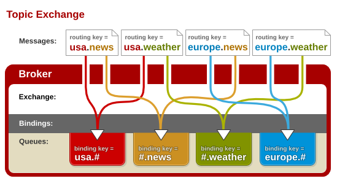

# MQ Structure


| Analogy 概念類比 |          |
| :--------------- | :------- |
| Producer         | 送信這   |
| Exchange         | 郵局     |
| Binding          | 送抵規則 |
| Queue            | 目標郵箱 |
| Consumer         | 收信對象 |

<br/>

---

<br/>

## Make Works with Basci Connection

```sh
docker-compose up -d rabbitmq exp-1 && \
docker logs -f mq-basic-exp-1
```

then open [manager](http://localhost:15672/), exchange tab -> trial_exchange to publish message

```sh
# can restart exp-1 after made changes
docker-compose restart exp-1
```

<br/>

---

<br/>

## Fanout


Message To Every Queue which the "Exchange" is Binded

```sh
docker-compose up -d rabbitmq exp-2 && \
docker logs -f mq-basic-exp-2
```

<br/>

---

<br/>

## Direct Exchange


**For Exact Match**

用 routingKey 作路由，但 routingKey 和 queue 只能是一对一關係 （one-to-one）
bind 左之後，只要 routingKey 中，都會收到 message

```sh
docker-compose up -d rabbitmq exp-3 && \
docker logs -f mq-basic-exp-3
```

Routing Key:

- trial_routingKey_3_A
- trial_routingKey_3_B

<br/>

---

<br/>

## Topic Exchange



**For Segmentatial Match**
支持路由键的模糊匹配，队列需要绑定要一个模式上。

- 词 (word), 意思是用點號間開的內容
- 符号“#”匹配一个或多个词 (hash) can substitute for zero or more words.
- 符号“\*”匹配不多不少一个词 (star) can substitute for exactly one word. 多數只用於頭同尾

[Official Tutor](https://www.rabbitmq.com/tutorials/tutorial-five-python.html)

```sh
docker-compose up -d rabbitmq exp-4 && \
docker logs -f mq-basic-exp-4
```

<br/>

---

<br/>

## Sample Publisher

need works with exp-4

```sh
docker-compose up -d rabbitmq exp-5 && \
docker logs -f mq-basic-exp-5

# to publish same as in GUI Manager
curl "localhost:4000/send?exchange=trial_exchange_4&topic=usa.news"
```

<br/>

---

<br/>

## Exchange Detailed Config

need works with exp-6

```sh
docker-compose up -d rabbitmq exp-6
```

View "Feature" in [manager](http://localhost:15672/) exchange tab

<br/>

---

<br/>

### When finished

```sh
docker-compose down
docker network prune
```

<br/>

---

<br/>

# Common Pattern of Usage 常見的使用模式

## 1: Worker Queue (Load-Balancing / Competition)


---

## 2: Pub/Sub 發布/訂閱


---

## 3: Routing 選擇性接收消息


---

## 4: Topic Pattern 模式識別


---

## 5: RPC 兩個 service 之間的調用

